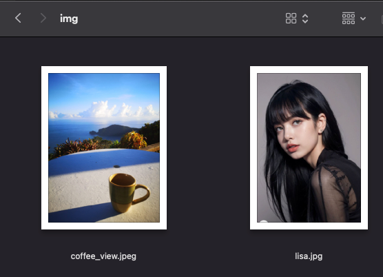
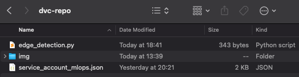

## DVC Lab: Upload and Download Images using GCS

### Objective

Set up a DVC (Data Version Control) workflow where:

- A **local computer** uploads an image folder to Google Cloud Storage (GCS).
- A **remote Ubuntu server** downloads the image folder from GCS using DVC and performs image edge detection on all images in the folder `img`, then pushes the results back to GCS.
- A **local computer** downloads the processed images from GCS.

---

### Prerequisites

- Python and DVC installed on both systems.
- A GCS bucket created with access credentials (service account JSON file).
- Internet access for both systems.

---

# Local Computer Steps (Create New Repository on GitHub and Upload to GCS)

### 1. Create and Initialize the Repository

```bash
mkdir dvc-repo
cd dvc-repo
```


### 2. Create and Activate Python Environment

#### For Windows:

```bash
python -m venv dvc_env
.\dvc_env\Scripts\activate
```

#### For macOS and Linux:

```bash
python3 -m venv dvc_env
source dvc_env/bin/activate
```


### 3. Install DVC and GCS Plugin and OpenCV for Image Processing

```bash
pip install --upgrade pip
pip install dvc dvc-gs opencv-python
```

### 4. Add .gitignore entry for dvc_env

After creating the virtual environment, ensure to add the `dvc_env` folder to your `.gitignore` to prevent committing the virtual environment to your repository. This is best practice, as virtual environments are specific to local machines and should not be version controlled.

```bash
if [ -f .gitignore ]; then
  echo "dvc_env" >> .gitignore
else
  echo "dvc_env" > .gitignore
fi
```


### 5. Copy the service_account.json file to the root of the repository


### 6. Initialize the repository and add the service_account.json file

```bash
git init
git add service_account.json
git commit -m "Initialize the repository and add service_account.json"
```

### 4. Create a Remote Repository

- Create a new repository on a platform like GitHub, GitLab, or Bitbucket.

   

### 5. Add Remote and Push

```bash
git branch -M main
git remote add origin [REMOTE-URL]
git push -u origin main
```


### 9. Initialize DVC Repository and Prepare Image Data 


  


```bash
mkdir img
# Manually copy images from ./LAB02/images to ./img

dvc init
git add .
git commit -m "Initialize DVC and add img folder"
```

### 10. Create edge_detection.py and Commit

This is the file that will be used to perform edge detection on the images.



Create a Python script named `edge_detection.py`, commit it to the repository, and run the following command to commit it:

```python
import cv2
import os

input_folder = "./img"
output_folder = "./processed_img"
os.makedirs(output_folder, exist_ok=True)

for filename in os.listdir(input_folder):
    img = cv2.imread(os.path.join(input_folder, filename), cv2.IMREAD_GRAYSCALE)
    edges = cv2.Canny(img, 100, 200)
    cv2.imwrite(os.path.join(output_folder, filename), edges)
```

Commit edge detection script:

```bash
git add .
git commit -m "Add edge detection script"
git push 
```


### 11. Track the Image Folder

```bash
dvc add ./img
git add img.dvc .gitignore
git commit -m "Track img folder with DVC"
```

### 12. Set Up GCS as a DVC Remote and Configure GCS Credentials

Copy `service_account.json` file to the root of the repository.


Create a service account in GCP and download the JSON key file. Specify the credentials:


(ระบบจะ นำ service_account.json ไปใช้ในการเชื่อมต่อกับ GCS bucket ที่สร้างไว้ ซึ่งตามรูปคือ โดยที่ url = gs://dvc_tp)

```bash
dvc remote add -d myremote gs://dvc_tp
dvc remote modify myremote credentialpath service_account.json
```


### 13. Push Data to GCS

```bash
dvc push
git push 
```

---

# Remote Server Ubuntu Steps (Download from GCS and Perform Image Edge Detection)

### 1. Install DVC, GCS Plugin, and OpenCV

```bash
sudo apt update
sudo apt install python3-pip
pip install dvc dvc-gs opencv-python
```

### 2. Clone the Repository

```bash
git clone <your-repo-url>
cd <repo-folder>
```

### 3. Set Up GCS Remote

Ensure the same GCS remote configuration is set:

```bash
dvc remote add -d myremote gs://<your-bucket-name>
dvc remote modify myremote credentialpath /path/to/your/service_account.json
```

### 4. Pull Data from GCS

```bash
dvc pull
```

### 5. Perform Image Edge Detection

Run the script:

```bash
python edge_detection.py
```

### 6. Track and Push Processed Data to GCS

```bash
dvc add processed_img
git add processed_img.dvc .gitignore
git commit -m "Add processed images with edge detection"
dvc push
```

---

## Local Computer Steps (Download Processed Images from GCS)

### 1. Pull the Updated Repository

```bash
git pull origin main
```

### 2. Pull Processed Images from GCS

```bash
dvc pull
```

### 3. Verify Processed Images

Check the `processed_img` folder to ensure all images have been downloaded.

---

### Clean-Up (Optional)

- To remove DVC-tracked data locally: `dvc remove img.dvc`
- To delete the bucket contents: `gsutil rm -r gs://<your-bucket-name>`

---

### Best Practices

- Always version your datasets with DVC.
- Use separate GCP credentials for different projects.
- Avoid hardcoding sensitive credentials directly in code or repositories.

---

This version should provide a clearer structure with proper topic numbering.