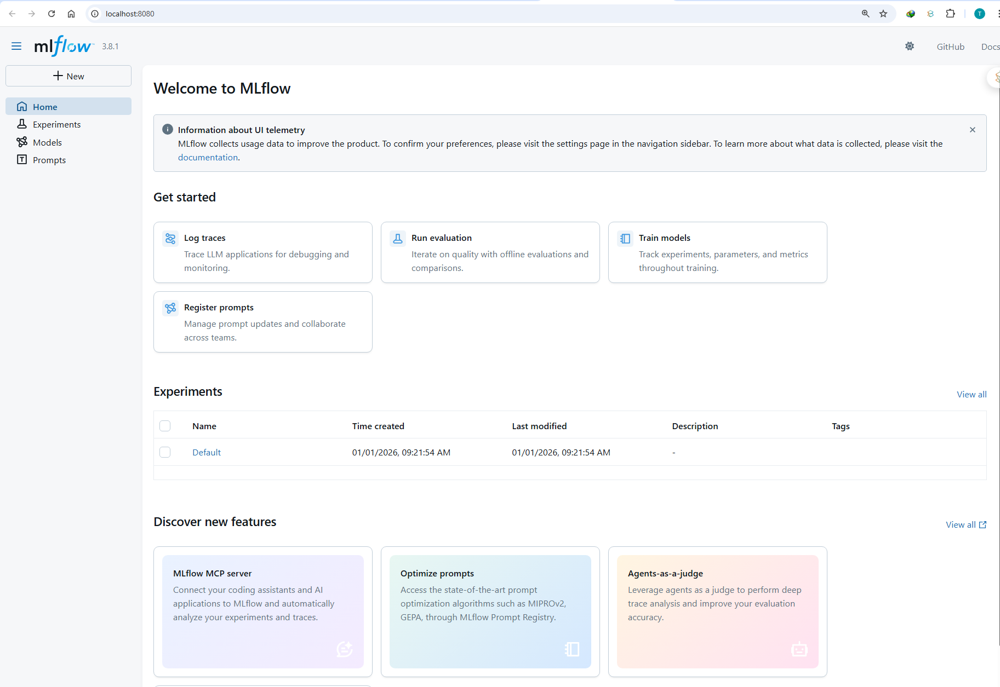

# 📖 คู่มือ MLflow Tracking พื้นฐาน

## 📋 สารบัญ

- [ภาพรวม](#ภาพรวม)
- [Pre-requisite](#️-pre-requisite-เตรียมความพร้อมก่อนเริ่ม-lab)
- [ส่วนที่ 1: การเชื่อมต่อ MLflow Server](#ส่วนที่-1-การเชื่อมต่อ-mlflow-server)
- [ส่วนที่ 2: การสร้าง Experiment](#ส่วนที่-2-การสร้าง-experiment)
- [ส่วนที่ 3: การสร้าง Run และบันทึก Parameters](#ส่วนที่-3-การสร้าง-run-และบันทึก-parameters)
- [ส่วนที่ 4: การบันทึก Metrics](#ส่วนที่-4-การบันทึก-metrics)
- [ส่วนที่ 5: การบันทึก Artifacts](#ส่วนที่-5-การบันทึก-artifacts)
- [ส่วนที่ 6: การบันทึก Model](#ส่วนที่-6-การบันทึก-model)
- [ส่วนที่ 7: Nested Runs](#ส่วนที่-7-nested-runs)
- [ส่วนที่ 8: การดูข้อมูลจาก MLflow UI](#ส่วนที่-8-การดูข้อมูลจาก-mlflow-ui)
- [สรุปและ Best Practices](#สรุปและ-best-practices)

---

## ภาพรวม

Lab นี้สอนการใช้งาน **MLflow Tracking** ซึ่งเป็นเครื่องมือสำคัญใน MLOps สำหรับติดตามและจัดการการทดลอง Machine Learning โดยครอบคลุมองค์ประกอบหลัก 5 ส่วน:

| องค์ประกอบ | คำอธิบาย | ตัวอย่าง |
|------------|----------|----------|
| **Experiment** | กลุ่มของการทดลองที่เกี่ยวข้องกัน | `fraud-detection`, `customer-churn` |
| **Run** | การทดลองแต่ละครั้ง | แต่ละครั้งที่ train model |
| **Parameters** | ค่าที่ตั้งก่อนเริ่มทดลอง (Input) | `learning_rate=0.001`, `epochs=100` |
| **Metrics** | ค่าที่วัดได้จากการทดลอง (Output) | `accuracy=0.92`, `loss=0.15` |
| **Artifacts** | ไฟล์ที่สร้างจากการทดลอง | `model.pkl`, `confusion_matrix.png` |

---

## Pre-requisite: เตรียมความพร้อมก่อนเริ่ม Lab

### สิ่งที่ต้องมี

ก่อนเริ่ม Lab นี้ ต้องมี services ต่อไปนี้รันอยู่และเข้าถึงได้:

| Service          | URL                   | หน้าที่                       |
| :--------------- | :-------------------- | :---------------------------- |
| MLflow Server    | http://127.0.0.1:8080 | ติดตามและจัดการ experiments   |
| Jupyter Notebook | http://127.0.0.1:8888 | เขียนและรัน code              |

### ขั้นตอนการตรวจสอบ

#### 1. ตรวจสอบ MLflow Server

เปิด Browser แล้วไปที่ http://127.0.0.1:8080



หากเห็นหน้า MLflow UI แสดงว่า Server พร้อมใช้งาน

#### 2. ตรวจสอบ Jupyter Server

เปิด Browser แล้วไปที่ http://127.0.0.1:8888


หากเห็นหน้า Jupyter Lab/Notebook แสดงว่า Server พร้อมใช้งาน

#### 3. Clone Lab Repository

เปิด Terminal ใน Jupyter แล้วรันคำสั่ง:
```bash
git clone -b dev https://github.com/Tuchsanai/MLOps.git
```

> **หมายเหตุ:** ใช้ branch `dev` สำหรับ Lab นี้

#### 4. เปิดไฟล์ Lab

เปิดไฟล์ `mlflow_tracking_lab.ipynb` ที่อยู่ใน path:
```
MLOps/02_MLFLOW/01_basic/02_MLflow_Tracking/LAB/mlflow_tracking_lab.ipynb
```

---

---

## ส่วนที่ 1: การเชื่อมต่อ MLflow Server

### แนวคิด

ก่อนใช้งาน MLflow Tracking ต้องกำหนด **Tracking URI** เพื่อบอกว่าจะเก็บข้อมูลการทดลองไว้ที่ไหน

### ฟังก์ชันสำคัญ

| ฟังก์ชัน | คำอธิบาย |
|----------|----------|
| `mlflow.set_tracking_uri(uri)` | กำหนด URL ของ MLflow Server |
| `mlflow.get_tracking_uri()` | ตรวจสอบ URL ที่กำหนดไว้ |

### ตัวอย่างโค้ด

```python
import mlflow

# กำหนด Tracking URI ไปยัง MLflow Server
mlflow.set_tracking_uri("http://127.0.0.1:8080")

# ตรวจสอบว่าเชื่อมต่อถูกต้อง
print(f"MLflow Tracking URI: {mlflow.get_tracking_uri()}")
```

### ผลลัพธ์ที่คาดหวัง

```
✅ MLflow Tracking URI: http://127.0.0.1:8080
```

### ทางเลือกอื่นสำหรับ Tracking URI

| ประเภท | ตัวอย่าง URI | คำอธิบาย |
|--------|--------------|----------|
| Local File | `file:///path/to/mlruns` | เก็บในโฟลเดอร์ local |
| Remote Server | `http://server:5000` | เก็บบน MLflow Server |
| Databricks | `databricks` | เก็บบน Databricks |
| SQLite | `sqlite:///mlflow.db` | เก็บใน SQLite database |

---

## ส่วนที่ 2: การสร้าง Experiment

### แนวคิด

**Experiment** คือกลุ่มของ Runs ที่เกี่ยวข้องกัน เปรียบเสมือน "โปรเจกต์" หรือ "หัวข้อการทดลอง"

```
Experiment: fraud-detection-project
├── Run 1: baseline-model
├── Run 2: lstm-v1
├── Run 3: lstm-v2-tuned
└── Run 4: transformer-model
```

### หลักการตั้งชื่อ Experiment

| ✅ ชื่อที่ดี | ❌ ชื่อที่ควรหลีกเลี่ยง |
|-------------|------------------------|
| `fraud-detection-lstm` | `test` |
| `customer-churn-prediction` | `experiment1` |
| `image-classification-resnet` | `my_model` |

### ฟังก์ชันสำคัญ

| ฟังก์ชัน | คำอธิบาย |
|----------|----------|
| `mlflow.set_experiment(name)` | สร้างหรือเลือก Experiment |
| `mlflow.get_experiment_by_name(name)` | ดึงข้อมูล Experiment |

### ตัวอย่างโค้ด

```python
# สร้างหรือเลือก Experiment
experiment_name = "mlflow-tracking-lab"
mlflow.set_experiment(experiment_name)

# ดูข้อมูล Experiment
experiment = mlflow.get_experiment_by_name(experiment_name)
print(f"Experiment Name: {experiment.name}")
print(f"Experiment ID: {experiment.experiment_id}")
print(f"Artifact Location: {experiment.artifact_location}")
print(f"Lifecycle Stage: {experiment.lifecycle_stage}")
```

### ผลลัพธ์ที่คาดหวัง

```
📁 Experiment Name: mlflow-tracking-lab
🆔 Experiment ID: 1
📂 Artifact Location: mlflow-artifacts:/1
🔄 Lifecycle Stage: active
```

### คุณสมบัติของ Experiment Object

| คุณสมบัติ | คำอธิบาย |
|-----------|----------|
| `name` | ชื่อ Experiment |
| `experiment_id` | ID เฉพาะของ Experiment |
| `artifact_location` | ที่เก็บ Artifacts |
| `lifecycle_stage` | สถานะ (`active` หรือ `deleted`) |
| `tags` | Tags ที่กำหนด |

---

## ส่วนที่ 3: การสร้าง Run และบันทึก Parameters

### แนวคิด

**Run** คือการทดลองแต่ละครั้ง เป็นหน่วยพื้นฐานที่สุดของ MLflow Tracking

**Parameters** คือค่าที่เราตั้งก่อนเริ่มการทดลอง (Input Configuration) ซึ่งเป็นค่าคงที่ตลอดการทดลอง

### ประเภทของ Parameters

| ประเภท | ตัวอย่าง |
|--------|----------|
| Model Hyperparameters | `learning_rate`, `batch_size`, `epochs` |
| Data Parameters | `train_split`, `image_size` |
| Architecture | `model_type`, `num_layers`, `hidden_units` |
| Training Config | `optimizer`, `loss_function` |

### ฟังก์ชันสำคัญ

| ฟังก์ชัน | คำอธิบาย |
|----------|----------|
| `mlflow.start_run(run_name)` | เริ่มต้น Run ใหม่ |
| `mlflow.log_param(key, value)` | บันทึก Parameter ทีละค่า |
| `mlflow.log_params(dict)` | บันทึกหลาย Parameters พร้อมกัน |
| `mlflow.active_run()` | ดึงข้อมูล Run ที่กำลังทำงานอยู่ |

### ตัวอย่างโค้ด

```python
# ตั้งค่า Experiment
mlflow.set_experiment("mlflow-tracking-lab")

# สร้าง Run และบันทึก Parameters
with mlflow.start_run(run_name="demo-parameters"):
    
    # วิธีที่ 1: บันทึกทีละค่า
    mlflow.log_param("learning_rate", 0.001)
    mlflow.log_param("batch_size", 32)
    mlflow.log_param("epochs", 100)
    
    # วิธีที่ 2: บันทึกหลายค่าพร้อมกัน (แนะนำ)
    mlflow.log_params({
        "optimizer": "adam",
        "dropout": 0.5,
        "hidden_units": 256,
        "activation": "relu",
        "model_type": "MLP"
    })
    
    # ดู Run ID
    run_id = mlflow.active_run().info.run_id
    print(f"Run ID: {run_id}")
```

### ผลลัพธ์ที่คาดหวัง

```
✅ สร้าง Run สำเร็จ!
🆔 Run ID: abc123def456...
📝 บันทึก Parameters: learning_rate, batch_size, epochs, optimizer, dropout, hidden_units, activation, model_type
```

### Context Manager (`with` statement)

การใช้ `with mlflow.start_run()` มีข้อดีคือ:
- Run จะถูกปิดอัตโนมัติเมื่อออกจาก block
- ป้องกันการลืมปิด Run
- จัดการ error ได้ดีกว่า

---

## ส่วนที่ 4: การบันทึก Metrics

### แนวคิด

**Metrics** คือค่าที่วัดได้จากการทดลอง (Output/Results) สามารถบันทึกได้หลายครั้งพร้อม step number

### ความแตกต่างระหว่าง Parameters และ Metrics

| คุณสมบัติ | Parameters | Metrics |
|-----------|------------|---------|
| เวลาบันทึก | ก่อนเริ่มทดลอง | ระหว่าง/หลังทดลอง |
| จำนวนค่า | ค่าเดียวต่อชื่อ | หลายค่าได้ (ต่าง step) |
| การเปลี่ยนแปลง | คงที่ | เปลี่ยนได้ตามเวลา |
| วัตถุประสงค์ | บอกว่าทำอะไร (Input) | บอกว่าได้ผลอย่างไร (Output) |

### ฟังก์ชันสำคัญ

| ฟังก์ชัน | คำอธิบาย |
|----------|----------|
| `mlflow.log_metric(key, value, step)` | บันทึก Metric ค่าเดียว |
| `mlflow.log_metrics(dict, step)` | บันทึกหลาย Metrics พร้อมกัน |

### ตัวอย่างโค้ด

```python
import random

with mlflow.start_run(run_name="demo-metrics"):
    
    # บันทึก Parameters ก่อน
    mlflow.log_params({
        "learning_rate": 0.01,
        "epochs": 10,
        "batch_size": 64
    })
    
    # จำลองการ Training และบันทึก Metrics ทุก epoch
    for epoch in range(10):
        # จำลองค่า loss และ accuracy
        train_loss = 1.0 - (epoch * 0.08) + random.uniform(-0.05, 0.05)
        val_loss = 1.0 - (epoch * 0.07) + random.uniform(-0.05, 0.05)
        train_acc = 0.5 + (epoch * 0.04) + random.uniform(-0.02, 0.02)
        val_acc = 0.5 + (epoch * 0.035) + random.uniform(-0.02, 0.02)
        
        # บันทึก Metrics พร้อม step
        mlflow.log_metrics({
            "train_loss": train_loss,
            "val_loss": val_loss,
            "train_accuracy": train_acc,
            "val_accuracy": val_acc
        }, step=epoch)
    
    # บันทึก Final Metrics
    mlflow.log_metrics({
        "final_accuracy": val_acc,
        "final_loss": val_loss
    })
```

### การใช้ Step Parameter

```python
# บันทึก metric พร้อม step (เช่น epoch number)
for epoch in range(100):
    loss = train_one_epoch()
    mlflow.log_metric("loss", loss, step=epoch)
```

Step ทำให้ MLflow สามารถสร้างกราฟแสดงการเปลี่ยนแปลงของ metric ตามเวลาได้

---

## ส่วนที่ 5: การบันทึก Artifacts

### แนวคิด

**Artifacts** คือไฟล์ที่สร้างจากการทดลอง MLflow จะเก็บไว้ใน Artifact Store

### ประเภทของ Artifacts

| ประเภท | ตัวอย่างไฟล์ |
|--------|-------------|
| Models | `model.pkl`, `model.h5`, `model.pt` |
| Visualizations | `confusion_matrix.png`, `loss_curve.png` |
| Data | `predictions.csv`, `feature_importance.json` |
| Reports | `report.html`, `summary.pdf` |
| Configs | `config.yaml`, `hyperparams.json` |

### ฟังก์ชันสำคัญ

| ฟังก์ชัน | คำอธิบาย |
|----------|----------|
| `mlflow.log_artifact(local_path, artifact_path)` | บันทึกไฟล์เดี่ยว |
| `mlflow.log_artifacts(local_dir, artifact_path)` | บันทึกทั้งโฟลเดอร์ |
| `mlflow.log_figure(fig, artifact_file)` | บันทึก matplotlib figure |
| `mlflow.log_dict(dict, artifact_file)` | บันทึก dictionary เป็น JSON |
| `mlflow.log_text(text, artifact_file)` | บันทึก text |

### ตัวอย่างโค้ด

```python
import matplotlib.pyplot as plt
import os

os.makedirs("outputs", exist_ok=True)

with mlflow.start_run(run_name="demo-artifacts"):
    
    # บันทึก Parameters และ Metrics
    mlflow.log_params({"model": "demo", "epochs": 10})
    mlflow.log_metric("accuracy", 0.92)
    
    # ----- Artifact 1: บันทึก Figure จาก matplotlib -----
    fig, axes = plt.subplots(1, 2, figsize=(12, 4))
    
    epochs = range(1, 11)
    train_loss = [1.0, 0.8, 0.65, 0.52, 0.42, 0.35, 0.30, 0.26, 0.23, 0.20]
    val_loss = [1.1, 0.9, 0.75, 0.62, 0.55, 0.50, 0.47, 0.45, 0.44, 0.43]
    
    axes[0].plot(epochs, train_loss, 'b-', label='Train Loss')
    axes[0].plot(epochs, val_loss, 'r-', label='Validation Loss')
    axes[0].set_xlabel('Epoch')
    axes[0].set_ylabel('Loss')
    axes[0].set_title('Training & Validation Loss')
    axes[0].legend()
    axes[0].grid(True)
    
    plt.tight_layout()
    
    # บันทึก figure โดยตรง
    mlflow.log_figure(fig, artifact_file="plots/training_curves.png")
    plt.close(fig)
    
    # ----- Artifact 2: บันทึก Dictionary เป็น JSON -----
    config = {
        "model_architecture": "CNN",
        "input_shape": [224, 224, 3],
        "num_classes": 10
    }
    mlflow.log_dict(config, artifact_file="config/model_config.json")
    
    # ----- Artifact 3: บันทึก Text -----
    model_info = """Model: CNN Classifier v1.0
Created: 2024
Author: MLflow Lab
"""
    mlflow.log_text(model_info, artifact_file="models/model_info.txt")
    
    # ----- Artifact 4: บันทึกไฟล์จาก Local -----
    with open("outputs/predictions.csv", "w") as f:
        f.write("id,true_label,predicted_label,confidence\n")
        f.write("1,cat,cat,0.95\n")
    
    mlflow.log_artifact("outputs/predictions.csv", artifact_path="data")
```

### โครงสร้าง Artifacts ที่ได้

```
artifacts/
├── plots/
│   └── training_curves.png
├── config/
│   └── model_config.json
├── models/
│   └── model_info.txt
└── data/
    └── predictions.csv
```

---

## ส่วนที่ 6: การบันทึก Model

### แนวคิด

**Model Logging** ช่วยบันทึก Model พร้อมข้อมูลที่จำเป็นสำหรับ Deployment:
- Model weights และ architecture
- Dependencies และ environment
- Input/Output signature
- ตัวอย่าง input

### MLflow Model Flavors

| Flavor | Library | ฟังก์ชัน |
|--------|---------|----------|
| `mlflow.sklearn` | Scikit-learn | `log_model()`, `load_model()` |
| `mlflow.pytorch` | PyTorch | `log_model()`, `load_model()` |
| `mlflow.tensorflow` | TensorFlow/Keras | `log_model()`, `load_model()` |
| `mlflow.xgboost` | XGBoost | `log_model()`, `load_model()` |
| `mlflow.pyfunc` | Generic Python | `log_model()`, `load_model()` |

### 6.1 บันทึก Scikit-learn Model

```python
from sklearn.datasets import load_iris
from sklearn.model_selection import train_test_split
from sklearn.ensemble import RandomForestClassifier
from sklearn.metrics import accuracy_score
from mlflow.models import infer_signature

# เตรียมข้อมูล
iris = load_iris()
X_train, X_test, y_train, y_test = train_test_split(
    iris.data, iris.target, test_size=0.2, random_state=42
)

with mlflow.start_run(run_name="sklearn-model-demo"):
    
    # กำหนด hyperparameters
    n_estimators = 100
    max_depth = 5
    
    # บันทึก Parameters
    mlflow.log_params({
        "n_estimators": n_estimators,
        "max_depth": max_depth,
        "model_type": "RandomForestClassifier"
    })
    
    # Train Model
    model = RandomForestClassifier(
        n_estimators=n_estimators,
        max_depth=max_depth,
        random_state=42
    )
    model.fit(X_train, y_train)
    
    # คำนวณ Metrics
    y_pred = model.predict(X_test)
    accuracy = accuracy_score(y_test, y_pred)
    mlflow.log_metric("accuracy", accuracy)
    
    # สร้าง Signature
    signature = infer_signature(X_train, model.predict(X_train))
    
    # บันทึก Model
    mlflow.sklearn.log_model(
        sk_model=model,
        artifact_path="model",
        signature=signature,
        input_example=X_train[:3]
    )
    
    sklearn_run_id = mlflow.active_run().info.run_id
```

### 6.2 โหลด Model กลับมาใช้งาน

```python
# โหลด Model
model_uri = f"runs:/{sklearn_run_id}/model"

# วิธีที่ 1: โหลดเป็น sklearn model
loaded_model = mlflow.sklearn.load_model(model_uri)

# วิธีที่ 2: โหลดเป็น pyfunc (generic)
pyfunc_model = mlflow.pyfunc.load_model(model_uri)

# ทดสอบทำนาย
predictions = loaded_model.predict(X_test[:5])
```

### รูปแบบ Model URI

| รูปแบบ | ตัวอย่าง | คำอธิบาย |
|--------|----------|----------|
| Runs | `runs:/<run_id>/model` | โหลดจาก Run ID |
| Models | `models:/<name>/<version>` | โหลดจาก Model Registry |
| Local Path | `/path/to/model` | โหลดจาก local path |

### 6.3 บันทึก PyTorch Model

```python
import torch
import torch.nn as nn

class SimpleNN(nn.Module):
    def __init__(self, input_size, hidden_size, num_classes):
        super(SimpleNN, self).__init__()
        self.fc1 = nn.Linear(input_size, hidden_size)
        self.relu = nn.ReLU()
        self.fc2 = nn.Linear(hidden_size, num_classes)
    
    def forward(self, x):
        out = self.fc1(x)
        out = self.relu(out)
        out = self.fc2(out)
        return out

with mlflow.start_run(run_name="pytorch-model-demo"):
    
    # สร้างและ train model...
    pytorch_model = SimpleNN(input_size=4, hidden_size=16, num_classes=3)
    
    # บันทึก PyTorch Model
    mlflow.pytorch.log_model(
        pytorch_model=pytorch_model,
        artifact_path="pytorch_model",
        signature=signature,
        input_example=X_train[:3]
    )
```

### 6.4 Autolog

**Autolog** บันทึก Parameters, Metrics และ Model อัตโนมัติ

```python
from sklearn.linear_model import LogisticRegression

# เปิด Autolog
mlflow.sklearn.autolog()

with mlflow.start_run(run_name="autolog-demo"):
    # แค่ train model ตามปกติ
    model = LogisticRegression(max_iter=200)
    model.fit(X_train, y_train)
    # MLflow จะบันทึกทุกอย่างอัตโนมัติ!

# ปิด Autolog
mlflow.sklearn.autolog(disable=True)
```

---

## ส่วนที่ 7: Nested Runs

### แนวคิด

**Nested Runs** ใช้จัดกลุ่มการทดลองที่เกี่ยวข้องกัน เหมาะสำหรับ:
- Hyperparameter Tuning
- Cross-Validation
- Ensemble Models

### โครงสร้าง Nested Runs

```
Parent Run: hyperparameter-tuning
├── Child Run 1: lr=0.001 → accuracy=0.85
├── Child Run 2: lr=0.01  → accuracy=0.92 ⭐ Best
└── Child Run 3: lr=0.1   → accuracy=0.70
```

### ตัวอย่างโค้ด

```python
learning_rates = [0.001, 0.01, 0.1]

with mlflow.start_run(run_name="hyperparameter-tuning"):
    
    mlflow.log_param("experiment_type", "learning_rate_search")
    mlflow.log_param("search_space", str(learning_rates))
    
    best_accuracy = 0
    best_lr = None
    
    for lr in learning_rates:
        # สร้าง Child Run (nested=True)
        with mlflow.start_run(run_name=f"lr-{lr}", nested=True):
            mlflow.log_param("learning_rate", lr)
            
            # Train และคำนวณ accuracy
            accuracy = train_and_evaluate(lr)
            
            mlflow.log_metric("accuracy", accuracy)
            
            if accuracy > best_accuracy:
                best_accuracy = accuracy
                best_lr = lr
    
    # บันทึกผลลัพธ์ที่ดีที่สุดใน Parent Run
    mlflow.log_metric("best_accuracy", best_accuracy)
    mlflow.log_param("best_learning_rate", best_lr)
```

### ข้อดีของ Nested Runs

| ข้อดี | คำอธิบาย |
|-------|----------|
| จัดระเบียบ | จัดกลุ่มการทดลองที่เกี่ยวข้องไว้ด้วยกัน |
| เปรียบเทียบง่าย | เห็นผลการทดลองทั้งหมดในที่เดียว |
| สรุปผล | Parent Run เก็บผลลัพธ์ที่ดีที่สุด |
| UI ชัดเจน | แสดงเป็น tree structure ใน MLflow UI |

---

## ส่วนที่ 8: การดูข้อมูลจาก MLflow UI

หลังจากบันทึกข้อมูลการทดลองแล้ว เราสามารถดูและวิเคราะห์ผลลัพธ์ผ่าน MLflow UI ซึ่งเป็น Web Interface ที่ใช้งานง่าย

### 8.1 การเข้าถึง MLflow UI

เปิด Browser แล้วไปที่: [http://127.0.0.1:8080](http://127.0.0.1:8080)


### 8.2 ส่วนประกอบหลักของ MLflow UI

#### 📁 Experiments Sidebar (แถบด้านซ้าย)

แสดงรายการ Experiments ทั้งหมด สามารถคลิกเลือกเพื่อดู Runs ภายใน


#### 📋 Runs Table (ตารางกลาง)

แสดงรายการ Runs ทั้งหมดใน Experiment ที่เลือก พร้อมข้อมูล:
- **Run Name**: ชื่อ Run
- **Created**: วันเวลาที่สร้าง
- **Duration**: ระยะเวลาที่ใช้
- **Parameters**: ค่า Parameters ที่บันทึก
- **Metrics**: ค่า Metrics ที่บันทึก


### 8.3 การดูรายละเอียด Run

คลิกที่ Run Name เพื่อดูรายละเอียด จะเห็นหน้าที่แบ่งเป็น Tabs:

#### Tab: Overview
แสดงข้อมูลทั่วไปของ Run


#### Tab: Parameters
แสดง Parameters ทั้งหมดที่บันทึก

```
learning_rate: 0.01
batch_size: 64
epochs: 10
optimizer: adam
model_type: MLP
```

#### Tab: Metrics
แสดง Metrics พร้อมกราฟแสดงการเปลี่ยนแปลงตาม step


#### Tab: Artifacts
แสดงไฟล์ที่บันทึกไว้ สามารถ Preview หรือ Download ได้


### 8.4 การเปรียบเทียบหลาย Runs

#### วิธีการเปรียบเทียบ:

1. **เลือก Runs**: คลิก checkbox หน้า Runs ที่ต้องการเปรียบเทียบ
2. **คลิก Compare**: กดปุ่ม "Compare" ที่ด้านบน


#### หน้า Compare View:

แสดงการเปรียบเทียบแบบ side-by-side:
- **Parameters Comparison**: เปรียบเทียบค่า Parameters
- **Metrics Comparison**: เปรียบเทียบค่า Metrics พร้อมกราฟ


### 8.5 การค้นหาและ Filter Runs

#### Filter ผ่าน UI:

ใช้ Search box ด้านบนตารางเพื่อ filter Runs

**ตัวอย่าง Filter Syntax:**

| Filter | ความหมาย |
|--------|----------|
| `metrics.accuracy > 0.9` | Runs ที่มี accuracy มากกว่า 0.9 |
| `params.learning_rate = "0.01"` | Runs ที่ใช้ learning_rate = 0.01 |
| `params.model_type = "MLP"` | Runs ที่ใช้ model_type = MLP |
| `status = "FINISHED"` | Runs ที่ทำงานเสร็จแล้ว |


#### Filter ผ่าน Python:

```python
# ค้นหา Runs ใน Experiment
runs = mlflow.search_runs(
    experiment_names=["mlflow-tracking-lab"],
    order_by=["start_time DESC"],
    max_results=10
)

print("📋 Recent Runs:")
print("=" * 80)
for _, row in runs.iterrows():
    run_name = row.get("tags.mlflow.runName", "N/A")
    status = row["status"]
    start_time = row["start_time"]
    
    # ดึง metrics (ถ้ามี)
    accuracy = row.get("metrics.accuracy", "N/A")
    
    print(f"  Run: {run_name:<25} | Status: {status:<10} | Accuracy: {accuracy}")
```

### 8.6 การดู Nested Runs

Nested Runs จะแสดงเป็นโครงสร้าง tree ใน UI:

```
📁 hyperparameter-tuning (Parent Run)
├── 📄 lr-0.001 (Child Run) - accuracy: 0.85
├── 📄 lr-0.01 (Child Run)  - accuracy: 0.92 ⭐
└── 📄 lr-0.1 (Child Run)   - accuracy: 0.70
```


คลิกที่ Parent Run จะเห็น Child Runs ทั้งหมด

### 8.7 การ Download Artifacts

#### วิธี Download:

1. เข้าไปที่หน้า Run Detail
2. คลิก Tab "Artifacts"
3. เลือกไฟล์ที่ต้องการ
4. คลิกปุ่ม Download


#### Download ผ่าน Python:

```python
import mlflow

# Download artifacts ทั้งหมดจาก Run
run_id = "your-run-id-here"
local_path = mlflow.artifacts.download_artifacts(
    run_id=run_id,
    artifact_path="",  # "" = download ทั้งหมด
    dst_path="./downloaded_artifacts"
)
print(f"Downloaded to: {local_path}")

# Download เฉพาะไฟล์
model_path = mlflow.artifacts.download_artifacts(
    run_id=run_id,
    artifact_path="model",
    dst_path="./my_model"
)
```

### 8.8 การจัดการ Tags

Tags ช่วยจัดกลุ่มและค้นหา Runs ได้ง่ายขึ้น

#### เพิ่ม Tags ผ่าน Python:

```python
with mlflow.start_run(run_name="tagged-run"):
    # บันทึก Tags
    mlflow.set_tag("team", "data-science")
    mlflow.set_tag("version", "v1.0")
    mlflow.set_tag("environment", "development")
    
    # บันทึกหลาย Tags พร้อมกัน
    mlflow.set_tags({
        "dataset": "iris",
        "framework": "sklearn"
    })
```

#### ค้นหาด้วย Tags:

```python
runs = mlflow.search_runs(
    experiment_names=["mlflow-tracking-lab"],
    filter_string="tags.team = 'data-science'"
)
```

### 8.9 ตัวอย่างโค้ดสำหรับวิเคราะห์ผลการทดลอง

```python
import mlflow
import pandas as pd

# ค้นหา Runs ทั้งหมดใน Experiment
runs = mlflow.search_runs(
    experiment_names=["mlflow-tracking-lab"],
    order_by=["metrics.accuracy DESC"],
    max_results=20
)

# แสดงสรุปผลการทดลอง
print("🏆 Top 5 Runs by Accuracy:")
print("=" * 80)

top_runs = runs.head(5)
for idx, row in top_runs.iterrows():
    run_name = row.get("tags.mlflow.runName", "N/A")
    accuracy = row.get("metrics.accuracy", 0)
    lr = row.get("params.learning_rate", "N/A")
    
    print(f"  {run_name:<30} | Accuracy: {accuracy:.4f} | LR: {lr}")

# วิเคราะห์ความสัมพันธ์ระหว่าง Parameters และ Metrics
print("\n📊 Analysis:")
if "params.learning_rate" in runs.columns and "metrics.accuracy" in runs.columns:
    # แปลง learning_rate เป็น float
    runs["lr_float"] = pd.to_numeric(runs["params.learning_rate"], errors="coerce")
    
    # หา learning_rate ที่ให้ accuracy สูงสุด
    best_idx = runs["metrics.accuracy"].idxmax()
    best_lr = runs.loc[best_idx, "params.learning_rate"]
    best_acc = runs.loc[best_idx, "metrics.accuracy"]
    
    print(f"  Best Learning Rate: {best_lr}")
    print(f"  Best Accuracy: {best_acc:.4f}")

print(f"\n🔗 ดูรายละเอียดเพิ่มเติมได้ที่: http://127.0.0.1:8080")
```

### 8.10 สรุปความสามารถ MLflow UI

| ฟีเจอร์ | คำอธิบาย | วิธีใช้งาน |
|---------|----------|-----------|
| **View Experiments** | ดูรายการ Experiments | คลิกที่ sidebar ซ้าย |
| **View Runs** | ดูรายการ Runs | คลิกที่ Experiment |
| **Run Details** | ดูรายละเอียด Run | คลิกที่ Run Name |
| **Compare Runs** | เปรียบเทียบหลาย Runs | เลือก Runs แล้วกด Compare |
| **View Metrics Graph** | ดูกราฟ Metrics | Tab Metrics ใน Run Detail |
| **Download Artifacts** | ดาวน์โหลดไฟล์ | Tab Artifacts แล้วกด Download |
| **Search & Filter** | ค้นหา Runs | ใช้ Search box |
| **View Nested Runs** | ดู Parent-Child Runs | คลิกที่ Parent Run |

---

## สรุปและ Best Practices

### สรุปองค์ประกอบหลัก

| องค์ประกอบ | ฟังก์ชันหลัก |
|------------|--------------|
| **Experiment** | `mlflow.set_experiment()` |
| **Run** | `mlflow.start_run()` |
| **Parameters** | `mlflow.log_param()`, `mlflow.log_params()` |
| **Metrics** | `mlflow.log_metric()`, `mlflow.log_metrics()` |
| **Artifacts** | `mlflow.log_artifact()`, `mlflow.log_figure()` |
| **Model** | `mlflow.<flavor>.log_model()` |

### Best Practices

#### 1. การตั้งชื่อ
- ✅ ใช้ชื่อที่สื่อความหมาย: `fraud-detection-lstm-v2`
- ❌ หลีกเลี่ยงชื่อทั่วไป: `test`, `experiment1`

#### 2. การบันทึก Parameters
- บันทึกทุกค่าที่มีผลต่อผลลัพธ์
- ใช้ `log_params()` สำหรับหลายค่าพร้อมกัน

#### 3. การบันทึก Metrics
- บันทึกพร้อม `step` เพื่อติดตามการเปลี่ยนแปลง
- บันทึกทั้ง training และ validation metrics

#### 4. การบันทึก Artifacts
- บันทึก plots, configs และ models
- จัดโครงสร้างโฟลเดอร์ให้ชัดเจน

#### 5. การบันทึก Model
- ใช้ `signature` และ `input_example`
- พิจารณาใช้ `autolog()` สำหรับความสะดวก

#### 6. การจัดระเบียบ
- ใช้ Nested Runs สำหรับ Hyperparameter Tuning
- ใช้ Tags เพื่อจัดกลุ่ม Runs

---

## 🔗 แหล่งข้อมูลเพิ่มเติม

- [MLflow Documentation](https://mlflow.org/docs/latest/index.html)
- [MLflow Tracking Guide](https://mlflow.org/docs/latest/tracking.html)
- [MLflow Model Registry](https://mlflow.org/docs/latest/model-registry.html)
- [MLflow Projects](https://mlflow.org/docs/latest/projects.html)

---

*เอกสารนี้จัดทำขึ้นสำหรับ MLflow Tracking Lab*