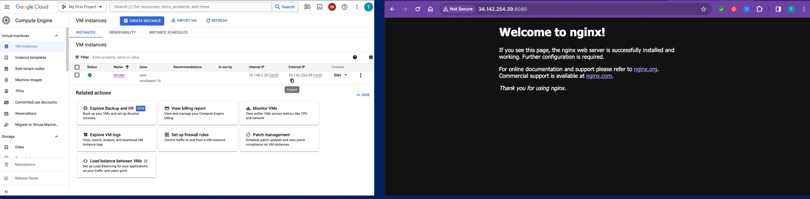

## create directory

   
    mkdir LAB3_Nginx_Port_mapping 
    cd    LAB3_Nginx_Port_mapping 
    

## git clone branch dev
    
    
   ```
    git clone  https://github.com/Tuchsanai/MLOps.git
   ```
   
   ```   
    cd MLOps/03_Docker_AND_API/Week09/LAB3_Nginx_Port_mapping
   ```


## Run Nginx with port mapping


docker run -p 8080:80 nginx





