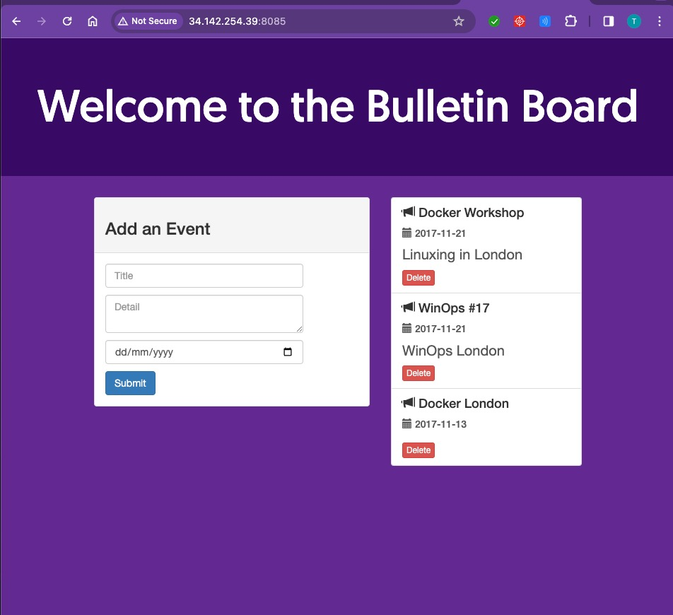

## create directory

   
    mkdir LAB5_node-bulletin-board-master
    cd    LAB5_node-bulletin-board-master
    

## git clone branch dev
    
    
   ```
   git clone  https://github.com/Tuchsanai/MLOps.git
   ```
   
   ```   
    cd MLOps/03_Docker_AND_API/Week09/LAB5_node-bulletin-board-master/bulletin-board-app
   ```


## 3 Build Docker image
```


docker build   -t bulletinboard:1.0 .


```

## 3 Run Nginx with port mapping and volume mapping

```
docker run -p 8085:8080 -d --name bb bulletinboard:1.0

```