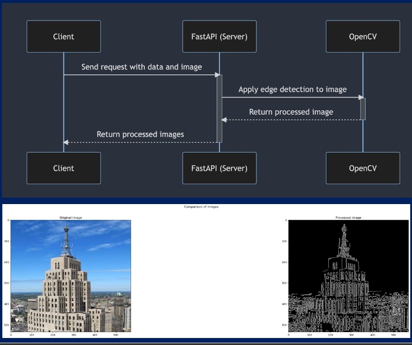

## create directory

   
    mkdir LAB4_Week10_Backend
    cd    LAB4_Week10_Backend
    

## git clone branch dev
    
    
   ```
    git clone https://github.com/Tuchsanai/MLOps.git
   ```
   
   ```   
    cd MLOps/03_Docker_AND_API/Week10/Lab2
   ```


### build Docker image with docker build 
```
docker build -t fastapi-docker_lab4 .
```

### Run the Docker container by executing the following command:
```
docker run -d -p 8088:80 fastapi-docker_lab4
```

