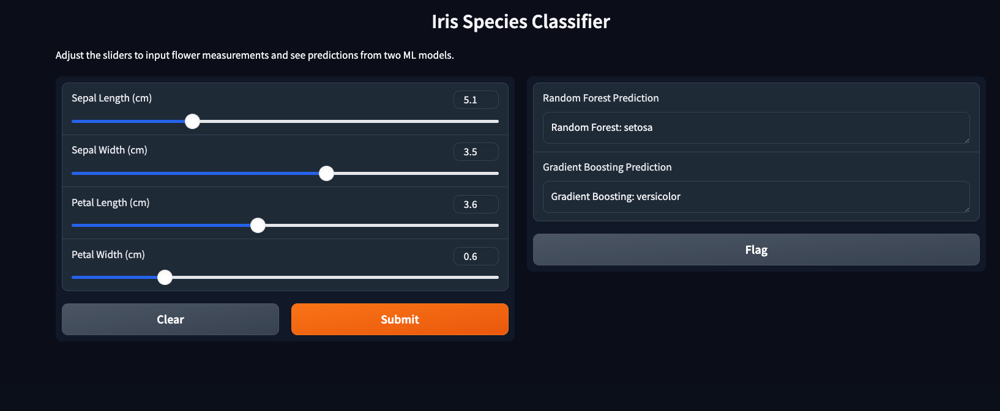

# Student Lab - Iris Classification with Machine Learning



## Project Overview

- **Backend**: FastAPI serving ML predictions
    - Port: 8087
    - Models: RandomForestClassifier, GradientBoostingClassifier
    - Dataset: Iris flower dataset

- **Frontend**: Gradio interface for input and visualization
    - Port: 8085
    - Features: Sliders for measurements, dual model predictions

- **Containerization**: Docker with separate images for frontend and backend

##### Visual Representation (Text-Based Diagram)

```
+------------------+                     +------------------+
|    User          |                     |                  |
| (Browser)        |<----HTTP:8085----->| Frontend         |
|                  |                     | (Gradio)         |
|                  |                     | - Sliders        |
|                  |                     | - Output Display |
+------------------+                     | Port: 8085       |
                                         +------------------+
                                                |
                                                | HTTP GET /predict
                                                | Port: 8087
                                                |
                                         +------------------+
                                         | Backend           |
                                         | (FastAPI)        |
                                         | - RF Model       |
                                         | - GB Model       |
                                         | - Iris Data      |
                                         | Port: 8087       |
                                         +------------------+

```

## Project Structure

```
student-lab/
├── backend/
│   ├── Dockerfile
│   ├── requirements.txt
│   └── app.py
├── frontend/
│   ├── Dockerfile
│   ├── requirements.txt
│   └── interface.py
└── README.md
```


## Setup and Running Instructions (Think by your self)

### 1. Clone the Repository


```bash
git clone git clone https://github.com/Tuchsanai/MLOps.git
cd  MLOps/03_Docker_AND_API/Week11/04_LAB_ml_with_Gradio
```


### 2. Build the Docker Images

Build the backend image:

```bash
cd backend
docker build -t iris-backend .
cd ..
```

Build the frontend image:

```bash
cd frontend
docker build -t iris-frontend .
cd ..
```

### 3. Run the Containers

Run the backend container:

```bash
docker run -d --name backend -p 8087:8087 iris-backend
```

Run the frontend container (linked to backend):

```bash
docker run -d --name frontend -p 8085:8085 --link backend iris-frontend
```

### 4. Access the Application

-   Open your web browser
-   Navigate to: `http://localhost:8085`
-   Use the sliders to input flower measurements
-   View predictions from both models


 ### Backend: backend/app.py

```bash
from fastapi import FastAPI
from pydantic import BaseModel
import numpy as np
from sklearn.datasets import load_iris
from sklearn.ensemble import RandomForestClassifier, GradientBoostingClassifier

app = FastAPI()

# Load and train models at startup
iris = load_iris()
X, y = iris.data, iris.target

# Train RandomForestClassifier
rf_model = RandomForestClassifier(random_state=42)
rf_model.fit(X, y)

# Train GradientBoostingClassifier
gb_model = GradientBoostingClassifier(random_state=42)
gb_model.fit(X, y)

# Input data model
class IrisInput(BaseModel):
    sepal_length: float
    sepal_width: float
    petal_length: float
    petal_width: float

@app.get("/health")
def health_check():
    return {"status": "healthy"}

@app.post("/predict")
def predict(data: IrisInput):
    # Convert input to array
    input_data = np.array([[data.sepal_length, data.sepal_width, 
                           data.petal_length, data.petal_width]])
    
    # Get predictions
    rf_pred = rf_model.predict(input_data)[0]
    gb_pred = gb_model.predict(input_data)[0]
    
    # Map predictions to Iris species
    species = {0: "setosa", 1: "versicolor", 2: "virginica"}
    
    return {
        "random_forest": species[rf_pred],
        "gradient_boosting": species[gb_pred]
    }

if __name__ == "__main__":
    import uvicorn
    uvicorn.run(app, host="0.0.0.0", port=8087)

```


# Backend: backend/requirements.txt

```bash
uvicorn
fastapi
scikit
numpy
pydantic
```

 ## Backend: backend/Dockerfile

```bash
FROM python:3.9-slim

WORKDIR /app

COPY requirements.txt .
RUN pip install --no-cache-dir -r requirements.txt

COPY app.py .

EXPOSE 8087

CMD ["python", "app.py"]
```


 ## Frontend: frontend/interface.py

 ```bash
 import gradio as gr
import requests

# Backend URL (adjusted for Docker linking)
BACKEND_URL = "http://backend:8087/predict"

def predict_iris(sepal_length, sepal_width, petal_length, petal_width):
    # Prepare data for API call
    data = {
        "sepal_length": sepal_length,
        "sepal_width": sepal_width,
        "petal_length": petal_length,
        "petal_width": petal_width
    }
    
    # Make request to backend
    try:
        response = requests.post(BACKEND_URL, json=data)
        response.raise_for_status()
        predictions = response.json()
        return (
            f"Random Forest: {predictions['random_forest']}",
            f"Gradient Boosting: {predictions['gradient_boosting']}"
        )
    except Exception as e:
        return f"Error: {str(e)}", f"Error: {str(e)}"

# Gradio interface
interface = gr.Interface(
    fn=predict_iris,
    inputs=[
        gr.Slider(4.0, 8.0, step=0.1, label="Sepal Length (cm)"),
        gr.Slider(2.0, 4.5, step=0.1, label="Sepal Width (cm)"),
        gr.Slider(1.0, 7.0, step=0.1, label="Petal Length (cm)"),
        gr.Slider(0.1, 2.5, step=0.1, label="Petal Width (cm)")
    ],
    outputs=[
        gr.Textbox(label="Random Forest Prediction"),
        gr.Textbox(label="Gradient Boosting Prediction")
    ],
    title="Iris Species Classifier",
    description="Adjust the sliders to input flower measurements and see predictions from two ML models."
)

if __name__ == "__main__":
    interface.launch(server_name="0.0.0.0", server_port=8085)
 ```

 ## frontend/requirements.txt

 ```bash
gradio
requests
 ```


## Frontend: frontend/Dockerfile

```bash
FROM python:3.9-slim

WORKDIR /app

COPY requirements.txt .
RUN pip install --no-cache-dir -r requirements.txt

COPY interface.py .

EXPOSE 8085

CMD ["python", "interface.py"]

```