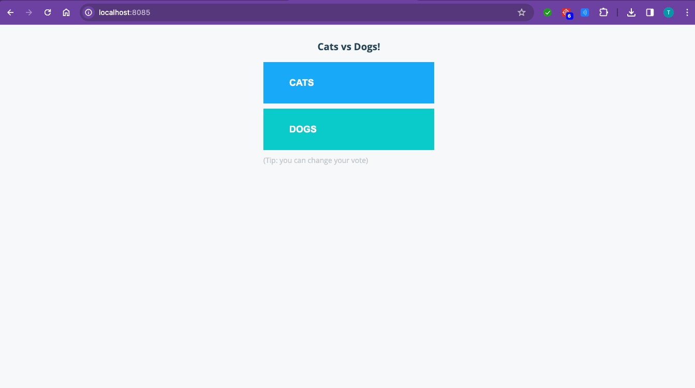

# Example Voting App

A simple distributed application running across multiple Docker containers.

## Getting started


* A front-end web app in [Python](/vote) which lets you vote between two options
* A [Redis](https://hub.docker.com/_/redis/) which collects new votes
* A [.NET](/worker/) worker which consumes votes and stores them in…
* A [Postgres](https://hub.docker.com/_/postgres/) database backed by a Docker volume
* A [Node.js](/result) web app which shows the results of the voting in real time


## create directory

   
    mkdir LAB5x_Week11
    cd    LAB5x_Week11
    

## git clone branch dev
    
    
   ```
    git clone xxxxxxxxxx
     
    cd xxxxx   
```


## docker-compose up
### This command is used to start the containers defined in the docker-compose.yml file. If the containers don't exist, they will be created.

```
docker-compose up

```

## Accessing the Services

* Access  at http://localhost:8085
* Access  at http://localhost:8087





## docker-compose down
### This command is used to stop and remove the containers defined in the docker-compose.yml file.


```
docker-compose down

```


## To delete all networks, images, and volumes with Docker Compose, you can use the following commands:

```
docker-compose down --rmi all --volumes --remove-orphans
```


* The --rmi all flag tells Docker to remove all images associated with the containers.

* The --volumes flag tells Docker to remove any volumes associated with the containers.

* The --remove-orphans flag tells Docker to remove any containers that were not defined in the docker-compose.yml file.

```
docker network prune
docker volume prune
```

* The second command (docker network prune) will remove any unused networks.

* The third command (docker volume prune) will remove any unused volumes.


# Delete all containers

```
docker stop $(docker ps -a -q)  
docker rm $(docker ps -a -q) 
docker rmi $(docker images -q) 
docker volume rm $(docker volume ls -q)  
docker network prune -f
```