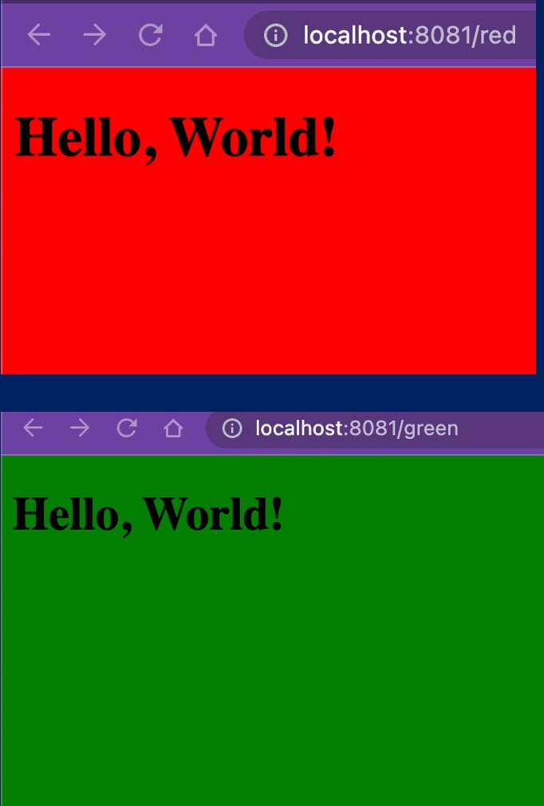

# Lab 2: Docker Flask App with Environment Variables



## Overview

แล็บนี้จะสอนการสร้าง Docker Image สำหรับ Flask Web Application ที่สามารถเปลี่ยนสีพื้นหลังของหน้าเว็บได้ผ่าน **Environment Variable** (`APP_COLOR`) โดยจะได้เรียนรู้:

- การเขียน `Dockerfile` สำหรับ Python Flask App
- การใช้ `docker build` สร้าง Image
- การใช้ `docker run` พร้อม Environment Variable (`-e`)
- การ Map Port ด้วย `-p` flag
- การรัน Container หลายตัวจาก Image เดียวกันด้วยค่า config ต่างกัน

---

## Project Structure

```
Lab2/
├── Dockerfile          # คำสั่งสร้าง Docker Image
├── app.py              # Flask Application หลัก
├── index.html          # HTML Template แสดงสีพื้นหลัง
├── requirements.txt    # Python dependencies (flask)
└── readme.md           # เอกสารนี้
```

---

## File Details

### 1. `Dockerfile`

```dockerfile
FROM python:3.8-alpine

WORKDIR /app
COPY requirements.txt requirements.txt
COPY . .

RUN pip install -r requirements.txt
EXPOSE 8081
CMD ["python", "app.py"]
```

| คำสั่ง | คำอธิบาย |
|--------|----------|
| `FROM python:3.8-alpine` | ใช้ Python 3.8 บน Alpine Linux (image ขนาดเล็ก) เป็น Base Image |
| `WORKDIR /app` | กำหนด Working Directory ภายใน Container เป็น `/app` |
| `COPY requirements.txt requirements.txt` | Copy ไฟล์ requirements.txt เข้า Container ก่อน (เพื่อ cache layer) |
| `COPY . .` | Copy ไฟล์ทั้งหมดในโฟลเดอร์ปัจจุบันเข้า Container |
| `RUN pip install -r requirements.txt` | ติดตั้ง Python packages ที่ต้องการ (flask) |
| `EXPOSE 8081` | ประกาศว่า Container จะใช้ Port 8081 |
| `CMD ["python", "app.py"]` | คำสั่งเริ่มต้นเมื่อ Container ทำงาน |

### 2. `app.py`

```python
import os
from flask import Flask, render_template

app = Flask(__name__, template_folder="")

@app.route('/')
def home():
    env_var_colour = os.environ['APP_COLOR']
    return render_template("index.html", color=env_var_colour)

@app.route('/<string:name>')
def template(name):
    return render_template("index.html", color=name)

if __name__ == '__main__':
    app.run(host="0.0.0.0", port="8081")
```

| ส่วน | คำอธิบาย |
|------|----------|
| `template_folder=""` | ใช้โฟลเดอร์ปัจจุบันเป็นที่เก็บ Template (แทน `templates/`) |
| `os.environ['APP_COLOR']` | อ่านค่าสี Background จาก Environment Variable `APP_COLOR` |
| `route('/')` | หน้าหลัก — แสดงสีตาม Environment Variable |
| `route('/<string:name>')` | รับชื่อสีจาก URL path เช่น `/blue` จะแสดงพื้นหลังสีน้ำเงิน |
| `host="0.0.0.0"` | รับ connection จากทุก network interface (จำเป็นสำหรับ Docker) |
| `port="8081"` | Flask ทำงานที่ Port 8081 |

### 3. `index.html`

```html
<!DOCTYPE html>
<html>
<head>
    <title>Flask HTML Template</title>
    <style>
        body {
            background-color: {{ color }};
        }
    </style>
</head>
<body>
    <h1>Hello, World!</h1>
</body>
</html>
```

- ใช้ Jinja2 Template `{{ color }}` เพื่อแทรกค่าสีใน CSS `background-color`
- เมื่อ Flask ส่งค่า `color="red"` มา จะได้ `background-color: red;`

### 4. `requirements.txt`

```
flask
```

- ติดตั้ง Flask framework เพียง package เดียว

---

## How to Run

### Step 1: Build Docker Image

```bash
docker build -t flask-docker-app .
```

| Flag | คำอธิบาย |
|------|----------|
| `-t flask-docker-app` | ตั้งชื่อ Image ว่า `flask-docker-app` |
| `.` | ใช้ Dockerfile จากโฟลเดอร์ปัจจุบัน |

### Step 2: Run Containers

**Container สีแดง (Port 8081):**

```bash
docker run -p 8081:8081 -d --name container_red -e APP_COLOR=red flask-docker-app
```

**Container สีเขียว (Port 8085):**

```bash
docker run -p 8085:8081 -d --name container_green -e APP_COLOR=green flask-docker-app
```

| Flag | คำอธิบาย |
|------|----------|
| `-p 8081:8081` | Map Port ของ Host (ซ้าย) ไปยัง Port ของ Container (ขวา) |
| `-d` | รันแบบ Detached Mode (ทำงานใน Background) |
| `--name container_red` | ตั้งชื่อ Container |
| `-e APP_COLOR=red` | กำหนด Environment Variable `APP_COLOR` เป็น `red` |

### Step 3: Access the Application

| Container | URL | สีพื้นหลัง |
|-----------|-----|-----------|
| container_red | `http://localhost:8081` | แดง |
| container_green | `http://localhost:8085` | เขียว |

นอกจากนี้สามารถเปลี่ยนสีผ่าน URL path ได้ เช่น:
- `http://localhost:8081/blue` — พื้นหลังสีน้ำเงิน
- `http://localhost:8085/yellow` — พื้นหลังสีเหลือง

---

## Useful Docker Commands

```bash
# ดู Container ที่กำลังทำงาน
docker ps

# หยุด Container
docker stop container_red container_green

# ลบ Container
docker rm container_red container_green

# ดู Docker Images ทั้งหมด
docker images

# ลบ Image
docker rmi flask-docker-app

# ดู Logs ของ Container
docker logs container_red
```

---

## Key Concepts

1. **Environment Variable ใน Docker** — ใช้ `-e` flag ส่งค่า config เข้า Container โดยไม่ต้องแก้ไข code
2. **Port Mapping** — ใช้ `-p HOST:CONTAINER` เพื่อเปิดให้เข้าถึง Container จากภายนอก
3. **Multiple Containers จาก Image เดียว** — สร้าง Container หลายตัวจาก Image เดียวกัน แต่ config ต่างกันด้วย Environment Variable
