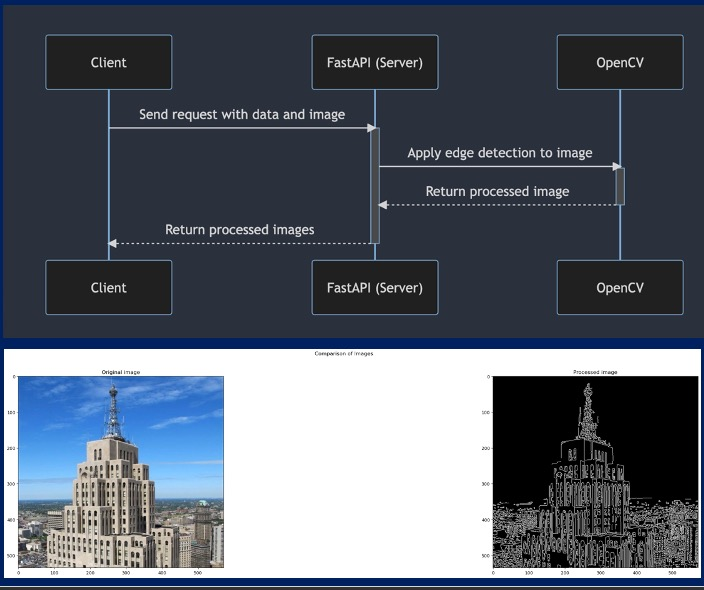
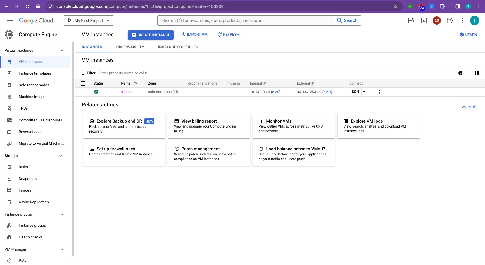
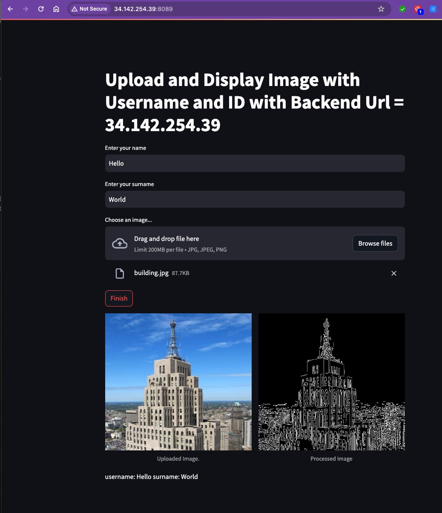

# Lab 3: แอปพลิเคชัน Docker แบบหลาย Container (Frontend + Backend)

## วัตถุประสงค์

ในแล็บนี้ นักศึกษาจะได้เรียนรู้การสร้างและรัน **แอปพลิเคชัน Docker แบบหลาย Container** ที่ประกอบด้วย:

- **Backend** : เซิร์ฟเวอร์ FastAPI ที่รับรูปภาพ ทำการ **ตรวจจับขอบ (Canny Edge Detection)** ด้วย OpenCV และส่งรูปภาพที่ประมวลผลแล้วกลับมา
- **Frontend** : เว็บแอป Streamlit ที่ให้ผู้ใช้อัปโหลดรูปภาพ กรอกชื่อ-นามสกุล ส่งไปยัง Backend API และแสดงผลลัพธ์เปรียบเทียบกัน

สิ่งที่จะได้ฝึกปฏิบัติ:
- การเขียน Dockerfile สำหรับแอปพลิเคชัน Python
- การ Build และ Run Docker Container
- การเชื่อมต่อ Frontend Container กับ Backend Container ผ่าน Environment Variable
- การ Encode/Decode รูปภาพเป็น Base64 String สำหรับการสื่อสารผ่าน API

---

## ภาพรวมสถาปัตยกรรม

```
┌─────────────────────┐         HTTP POST          ┌─────────────────────┐
│                     │   /process-image (JSON)     │                     │
│   Frontend          │ ──────────────────────────► │   Backend           │
│   (Streamlit)       │                             │   (FastAPI)         │
│   Port: 8089        │ ◄────────────────────────── │   Port: 8088        │
│                     │    processed image (JSON)   │                     │
└─────────────────────┘                             └─────────────────────┘
      Host :8089 → Container :8501                    Host :8088 → Container :80
```

**ลำดับการทำงาน:**
1. ผู้ใช้อัปโหลดรูปภาพ และกรอกชื่อ-นามสกุล บนหน้าเว็บ Streamlit (Frontend)
2. Frontend จะ Encode รูปภาพเป็น Base64 String แล้วส่ง POST Request ไปยัง Backend
3. Backend จะ Decode รูปภาพ ทำการตรวจจับขอบด้วย Canny แล้ว Encode ผลลัพธ์กลับ
4. Frontend แสดงรูปภาพต้นฉบับและรูปภาพที่ประมวลผลแล้วเปรียบเทียบกัน

**แผนภาพ Sequence Diagram และตัวอย่างผลลัพธ์การประมวลผลรูปภาพ:**



---

## โครงสร้างโปรเจกต์

```
Lab3/
├── backend/
│   ├── Dockerfile           # ไฟล์กำหนดการสร้าง Docker Image สำหรับ Backend
│   ├── main.py              # แอปพลิเคชัน FastAPI พร้อม Endpoint ประมวลผลรูปภาพ
│   ├── requirements.txt     # รายการ Dependencies ของ Python
│   └── output.jpg           # ตัวอย่างภาพหน้าจอผลลัพธ์
├── frontend/
│   ├── Dockerfile           # ไฟล์กำหนดการสร้าง Docker Image สำหรับ Frontend
│   ├── app.py               # แอปพลิเคชัน Streamlit (UI + API Client)
│   ├── requirements.txt     # รายการ Dependencies ของ Python
│   ├── client_main.ipynb    # Jupyter Notebook สำหรับทดสอบ Backend API
│   ├── cat.jpg              # รูปภาพตัวอย่างสำหรับทดสอบ
│   ├── building.jpg         # รูปภาพตัวอย่างสำหรับทดสอบ
│   ├── output.jpg           # ตัวอย่างภาพหน้าจอผลลัพธ์
│   └── server.jpg           # ตัวอย่างภาพหน้าจอเซิร์ฟเวอร์
└── readme.md                # ไฟล์นี้
```

---

## ส่วนที่ 1: Backend (FastAPI + OpenCV)

### 1.1 ทำความเข้าใจโค้ด Backend

**`backend/main.py`** — เซิร์ฟเวอร์ FastAPI ที่มี POST Endpoint หนึ่งตัว:

```python
@app.post("/process-image")
async def process_image(image_request: ImageRequest):
    image = decode_image(image_request.image)      # Base64 → NumPy array
    edges = apply_canny(image)                      # ตรวจจับขอบด้วย Canny
    processed_image = encode_image(edges)           # NumPy array → Base64
    return {
        "name": image_request.name,
        "surname": image_request.surname,
        "numbers": image_request.numbers,
        "processed_image": processed_image
    }
```

**รูปแบบ Request Body** (`ImageRequest`):

| ฟิลด์    | ชนิดข้อมูล  | คำอธิบาย                              |
|----------|-------------|---------------------------------------|
| image    | `str`       | รูปภาพที่ Encode เป็น Base64 String    |
| name     | `str`       | ชื่อของผู้ใช้                           |
| surname  | `str`       | นามสกุลของผู้ใช้                        |
| numbers  | `List[int]` | รายการของจำนวนเต็ม                     |

**ฟังก์ชันสำคัญ:**
- `encode_image(image)` — แปลง NumPy Image Array เป็น Base64 String โดยมี Prefix `data:image/jpeg;base64,`
- `decode_image(image_string)` — แปลง Base64 String กลับเป็น NumPy Image Array
- `apply_canny(image)` — แปลงเป็นภาพขาวดำ (Grayscale) แล้วทำ Canny Edge Detection (`threshold1=100`, `threshold2=200`)

**ตัวอย่างรูปภาพ Input ที่ใช้ทดสอบ:**

| รูปภาพตัวอย่าง 1 (cat.jpg) | รูปภาพตัวอย่าง 2 (building.jpg) |
|:--:|:--:|
|  |  |

### 1.2 Dockerfile ของ Backend

```dockerfile
FROM python:3.9-slim-buster

WORKDIR /app

COPY requirements.txt .
RUN pip install -r requirements.txt

COPY . .

CMD ["uvicorn", "main:app", "--host", "0.0.0.0", "--port", "80"]
```

**คำอธิบายแต่ละบรรทัด:**

| บรรทัด | คำอธิบาย |
|--------|----------|
| `FROM python:3.9-slim-buster` | ใช้ Base Image ของ Python 3.9 แบบเบา (slim) |
| `WORKDIR /app` | กำหนด Working Directory ภายใน Container |
| `COPY requirements.txt .` | คัดลอก requirements ก่อน (เพื่อใช้ Docker Layer Caching) |
| `RUN pip install -r requirements.txt` | ติดตั้ง Dependencies ของ Python |
| `COPY . .` | คัดลอกโค้ดแอปพลิเคชันทั้งหมด |
| `CMD [...]` | เริ่มต้น Uvicorn Server บน Port 80 ภายใน Container |

### 1.3 Build และ Run Backend

**ขั้นตอนที่ 1: Build Docker Image**
```bash
docker build -t fastapi-backend-lab3 ./backend
```

**ขั้นตอนที่ 2: Run Container**
```bash
docker run -d -p 8088:80 --name backend-lab3 fastapi-backend-lab3
```

| Flag | คำอธิบาย |
|------|----------|
| `-d` | รันในโหมด Detached (ทำงานเบื้องหลัง) |
| `-p 8088:80` | Map Port ของ Host `8088` ไปยัง Port `80` ของ Container |
| `--name backend-lab3` | ตั้งชื่อ Container เพื่อให้อ้างอิงได้ง่าย |

**ขั้นตอนที่ 3: ตรวจสอบว่า Backend ทำงานอยู่**
```bash
# ตรวจสอบ Container ที่กำลังทำงาน
docker ps

# เปิด FastAPI Docs ในเว็บเบราว์เซอร์
# http://localhost:8088/docs
```

**ตัวอย่างหน้าจอ Backend ที่รันบน Cloud VM (Google Cloud):**



---

## ส่วนที่ 2: Frontend (Streamlit)

### 2.1 ทำความเข้าใจโค้ด Frontend

**`frontend/app.py`** — เว็บแอปพลิเคชัน Streamlit ที่ทำหน้าที่:

1. อ่าน URL ของ Backend จาก **Environment Variable** `BACKEND_URL` (ค่าเริ่มต้นคือ `127.0.0.1`)
2. แสดงฟอร์มให้กรอกชื่อ/นามสกุล และอัปโหลดรูปภาพ
3. เมื่อกดปุ่ม จะ Encode รูปภาพเป็น Base64 แล้วส่ง POST Request ไปยัง Backend
4. แสดงรูปภาพต้นฉบับ และรูปภาพที่ตรวจจับขอบแล้ว เคียงข้างกัน

#### 2.1.1 ส่วนที่ 1 — Import Library และ ฟังก์ชัน Encode/Decode รูปภาพ

```python
import streamlit as st          # สร้างหน้าเว็บ UI
from PIL import Image            # อ่านไฟล์รูปภาพ
import os                        # อ่าน Environment Variable
import cv2                       # ประมวลผลรูปภาพ (OpenCV)
import requests                  # ส่ง HTTP Request ไปยัง Backend
import base64                    # แปลงรูปภาพเป็น Base64
import numpy as np               # จัดการข้อมูลแบบ Array
import json                      # แปลง JSON Response
```

```python
# ฟังก์ชัน Encode: แปลงรูปภาพ (NumPy Array) → Base64 String
# ใช้ตอนส่งรูปภาพไปยัง Backend ผ่าน JSON
def encode_image(image):
    _, encoded_image = cv2.imencode(".jpg", image)          # แปลงเป็น JPG bytes
    return "data:image/jpeg;base64," + base64.b64encode(encoded_image).decode()
                                                            # แปลงเป็น Base64 String

# ฟังก์ชัน Decode: แปลง Base64 String → รูปภาพ (NumPy Array)
# ใช้ตอนรับรูปภาพที่ประมวลผลแล้วกลับจาก Backend
def decode_image(image_string):
    encoded_data = image_string.split(',')[1]               # ตัด prefix ออก
    nparr = np.frombuffer(base64.b64decode(encoded_data), np.uint8)  # แปลงเป็น bytes
    return cv2.imdecode(nparr, cv2.IMREAD_COLOR)            # แปลงเป็นรูปภาพ
```

#### 2.1.2 ส่วนที่ 2 — อ่าน Backend URL จาก Environment Variable

```python
# อ่านค่า BACKEND_URL จาก Environment Variable
# ถ้าไม่ได้กำหนด จะใช้ค่าเริ่มต้นเป็น '127.0.0.1'
env_BACKEND_URL = os.environ.get('BACKEND_URL', '127.0.0.1')
```

> **สำคัญ:** Environment Variable `BACKEND_URL` ใช้กำหนดว่า Frontend จะส่ง Request ไปที่ไหน สิ่งนี้จำเป็นมากเมื่อรันใน Docker เพราะ `localhost` ภายใน Container จะหมายถึงตัว Container เอง ไม่ใช่เครื่อง Host

```
ตัวอย่างการกำหนดค่า:
┌─────────────────────────────────────────────────────────────┐
│  รันบนเครื่องตัวเอง (ไม่ใช่ Docker):  127.0.0.1            │
│  รันบน Docker (Linux):                 IP ของเครื่อง Host   │
│  รันบน Docker (macOS/Windows):         host.docker.internal │
│  รันบน Cloud VM:                       IP ของ VM เช่น       │
│                                        34.142.254.39        │
└─────────────────────────────────────────────────────────────┘
```

#### 2.1.3 ส่วนที่ 3 — สร้างหน้าเว็บ UI ด้วย Streamlit

```python
# แสดงหัวข้อหน้าเว็บ พร้อมแสดง Backend URL ที่ใช้งาน
st.title(f'Upload and Display Image with Username and ID with Backend Url = {env_BACKEND_URL}')

# สร้างช่องกรอกข้อมูล
username = st.text_input("Enter your name")       # ช่องกรอกชื่อ
surname  = st.text_input("Enter your surname")    # ช่องกรอกนามสกุล

# สร้างช่องอัปโหลดรูปภาพ (รองรับ jpg, jpeg, png)
uploaded_file = st.file_uploader("Choose an image...", type=["jpg", "jpeg", "png"])
```

#### 2.1.4 ส่วนที่ 4 — ส่งรูปภาพไป Backend และแสดงผลลัพธ์

```python
if st.button('Finish'):                           # เมื่อกดปุ่ม "Finish"
    if uploaded_file is not None:                  # ถ้ามีการอัปโหลดรูปภาพ
        col1, col2 = st.columns(2)                # แบ่งหน้าจอเป็น 2 คอลัมน์

        # ===== คอลัมน์ซ้าย: แสดงรูปภาพต้นฉบับ =====
        with col1:
            image = Image.open(uploaded_file)
            st.image(image, caption='Uploaded Image.', use_column_width=True)
            st.write('username: ', username, 'surname: ', surname)

        # ===== คอลัมน์ขวา: ส่งไป Backend แล้วแสดงผลลัพธ์ =====
        with col2:
            image = Image.open(uploaded_file)
            encoded_image = encode_image(np.array(image))    # แปลงรูปเป็น Base64

            # สร้าง JSON Payload สำหรับส่งไป Backend
            payload = {
                "image":   encoded_image,          # รูปภาพ Base64
                "name":    username,               # ชื่อ
                "surname": surname,                # นามสกุล
                "numbers": [1, 2, 3]               # ตัวเลขตัวอย่าง
            }

            # ส่ง POST Request ไปยัง Backend API
            response = requests.post(
                f"http://{env_BACKEND_URL}:8088/process-image",
                json=payload
            )

            # ตรวจสอบผลลัพธ์
            if response.status_code == 200:                  # สำเร็จ
                data = json.loads(response.content)
                processed_image_string = data["processed_image"]
                st.image(processed_image_string, caption="Processed Image")
            else:                                            # เกิดข้อผิดพลาด
                st.error(f"Error in processing the image: {response.status_code}")
    else:
        st.write("Please upload an image.")        # ยังไม่ได้อัปโหลดรูปภาพ
```

**สรุปการทำงานของโค้ด Frontend เป็นแผนภาพ:**

```
ผู้ใช้กดปุ่ม "Finish"
        │
        ▼
┌─── มีรูปภาพหรือไม่? ───┐
│                         │
▼ ใช่                     ▼ ไม่
┌──────────────┐    แสดงข้อความ
│  คอลัมน์ซ้าย │    "Please upload
│  แสดงรูปต้นฉบับ│    an image."
└──────┬───────┘
       │
       ▼
┌──────────────┐
│  คอลัมน์ขวา  │
│  1. Encode   │──► Base64 String
│  2. ส่ง POST │──► http://BACKEND:8088/process-image
│  3. รับผลลัพธ์│◄── JSON Response
│  4. แสดงรูป  │
└──────────────┘
```

### 2.2 Dockerfile ของ Frontend

```dockerfile
FROM python:3.8

WORKDIR /app

COPY . /app

EXPOSE 8501

RUN pip install -r requirements.txt

CMD ["streamlit", "run", "app.py", "--server.port=8501", "--server.address=0.0.0.0"]
```

**คำอธิบายแต่ละบรรทัด:**

| บรรทัด | คำอธิบาย |
|--------|----------|
| `FROM python:3.8` | ใช้ Base Image ของ Python 3.8 |
| `WORKDIR /app` | กำหนด Working Directory |
| `COPY . /app` | คัดลอกไฟล์แอปพลิเคชันทั้งหมด |
| `EXPOSE 8501` | ระบุว่า Container ใช้ Port 8501 |
| `RUN pip install ...` | ติดตั้ง Dependencies |
| `CMD [...]` | เริ่มต้น Streamlit Server บน Port 8501 |

### 2.3 Build และ Run Frontend

**ขั้นตอนที่ 1: Build Docker Image**
```bash
docker build -t streamlit-frontend-lab3 ./frontend
```

**ขั้นตอนที่ 2: Run Container**


**Run Frontend Container:**
```bash
docker run -d --rm -p 8089:8501 \
  -e BACKEND_URL=<YOUR_BACKEND_IP> \
  --name frontend-lab3 \
  streamlit-frontend-lab3
```

| Flag | คำอธิบาย |
|------|----------|
| `-d` | รันในโหมด Detached (เบื้องหลัง) |
| `--rm` | ลบ Container อัตโนมัติเมื่อหยุดทำงาน |
| `-p 8089:8501` | Map Port ของ Host `8089` ไปยัง Port `8501` ของ Container |
| `-e BACKEND_URL=...` | กำหนดค่า Environment Variable สำหรับ URL ของ Backend |

**ขั้นตอนที่ 3: เข้าใช้งาน Frontend**
```
http://localhost:8089
```

**ตัวอย่างหน้าจอ Frontend (Streamlit) ที่แสดงผลลัพธ์:**



---

## ส่วนที่ 3: ทดสอบ Backend ด้วย Jupyter Notebook

ไฟล์ `frontend/client_main.ipynb` เป็น Python Notebook Client สำหรับทดสอบ Backend API โดยตรง (ไม่ต้องผ่าน Streamlit Frontend)

### ขั้นตอนหลักใน Notebook:

```python
import requests, base64, cv2, json, numpy as np

# Encode รูปภาพ
image = cv2.imread('cat.jpg')
image = cv2.cvtColor(image, cv2.COLOR_BGR2RGB)
image_string = encode_image(image)

# ส่ง POST Request
payload = {
    "image": image_string,
    "name": "John",
    "surname": "Doe",
    "numbers": [1, 2, 3, 4, 5]
}

url = "http://127.0.0.1:8088"
response = requests.post(f"{url}/process-image", json=payload)
data = json.loads(response.content)

# Decode และแสดงรูปภาพที่ประมวลผลแล้ว
processed_image = decode_image(data["processed_image"])
```

> ต้องแน่ใจว่า Backend Container กำลังทำงานอยู่บน Port `8088` ก่อนที่จะรัน Notebook

---

## ส่วนที่ 4: สรุปขั้นตอนการทำงานทั้งหมด

### คำสั่งทีละขั้นตอน

```bash
# 1. Build Backend Image
docker build -t fastapi-backend-lab3 ./backend

# 2. Run Backend Container
docker run -d -p 8088:80 --name backend-lab3 fastapi-backend-lab3

# 3. Build Frontend Image
docker build -t streamlit-frontend-lab3 ./frontend

# 4. หา IP ของ Host (Linux)
export MY_IP=$(hostname -I | awk '{print $1}')

# 5. Run Frontend Container พร้อมกำหนด Backend URL
docker run -d --rm -p 8089:8501 \
  -e BACKEND_URL=$MY_IP \
  --name frontend-lab3 \
  streamlit-frontend-lab3

# 6. เปิดในเว็บเบราว์เซอร์
# Frontend:      http://localhost:8089
# Backend Docs:  http://localhost:8088/docs
```

### วิธีใช้งานแอปพลิเคชัน

1. เปิด `http://localhost:8089` ในเว็บเบราว์เซอร์
2. กรอก **ชื่อ** และ **นามสกุล**
3. อัปโหลด **รูปภาพ JPG/JPEG/PNG**
4. คลิกปุ่ม **"Finish"**
5. ดูผลลัพธ์: **รูปภาพต้นฉบับ** (ซ้าย) และ **รูปภาพที่ตรวจจับขอบแล้ว** (ขวา)

---

## การล้างข้อมูล (Cleanup)

หยุดและลบ Container และ Image ทั้งหมดที่สร้างในแล็บนี้:

```bash
# หยุด Container ที่กำลังทำงาน
docker stop backend-lab3 frontend-lab3

# ลบ Container
docker rm backend-lab3

# ลบ Image
docker rmi fastapi-backend-lab3 streamlit-frontend-lab3

# (ทางเลือก) ล้างทั้งหมด — ลบ Container, Image, Volume, Network ทั้งหมด
docker stop $(docker ps -a -q)
docker rm $(docker ps -a -q)
docker rmi $(docker images -q)
docker volume rm $(docker volume ls -q)
docker network prune -f
```

---

## สรุปแนวคิดที่ได้เรียนรู้

| แนวคิด | คำอธิบาย |
|--------|----------|
| **แอปหลาย Container** | การรัน Frontend และ Backend แยกกันคนละ Container |
| **การ Map Port** (`-p`) | การเปิด Port ของ Container ให้ Host เข้าถึงได้ (`host:container`) |
| **Environment Variable** (`-e`) | การส่งค่าคอนฟิก (เช่น Backend URL) ให้ Container ตอน Runtime |
| **การ Encode รูปภาพเป็น Base64** | การแปลงรูปภาพเป็น String เพื่อส่งผ่าน JSON API |
| **Canny Edge Detection** | อัลกอริทึมของ OpenCV สำหรับตรวจจับขอบในรูปภาพ |
| **Docker Layer Caching** | การคัดลอก `requirements.txt` ก่อนเพื่อ Cache การติดตั้ง Dependencies |
| **FastAPI + Uvicorn** | เว็บเฟรมเวิร์ก Python สมัยใหม่ที่รองรับ Async |
| **Streamlit** | เฟรมเวิร์กสำหรับสร้างเว็บแอป Data/ML อย่างรวดเร็ว |
