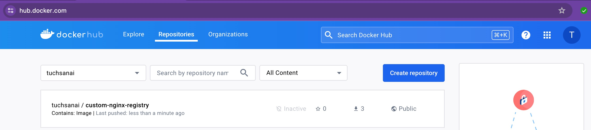
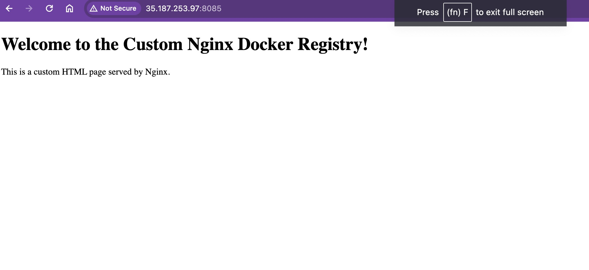

# Lab 2: Docker Registry (การใช้งาน Docker Hub)

## วัตถุประสงค์ของ Lab

Lab นี้จะสอนให้นักศึกษาเข้าใจการทำงานของ **Docker Registry** โดยเฉพาะ **Docker Hub** ซึ่งเป็นบริการเก็บและแจกจ่าย Docker Image แบบ Public/Private บน Cloud โดยนักศึกษาจะได้เรียนรู้:

1. การ Login เข้าสู่ Docker Hub ผ่าน Command Line
2. การสร้าง Docker Image จาก Dockerfile (Build)
3. การตั้งชื่อ Image ให้ตรงตามรูปแบบของ Docker Hub (Tag)
4. การ Push (อัปโหลด) Image ขึ้นไปเก็บบน Docker Hub
5. การ Pull (ดาวน์โหลด) Image กลับมาจาก Docker Hub
6. การ Run Container จาก Image ที่ Pull มา

### แนวคิดหลัก: Docker Registry คืออะไร?

**Docker Registry** คือที่เก็บ Docker Image แบบรวมศูนย์ คล้ายกับ GitHub ที่เก็บ Source Code แต่ Docker Registry เก็บ Docker Image แทน

- **Docker Hub** (hub.docker.com) คือ Public Registry ที่นิยมใช้มากที่สุด
- รูปแบบชื่อ Image บน Docker Hub: `<username>/<repository-name>:<tag>`
- ตัวอย่าง: `tuchsanai/custom-nginx-registry:2.0`

### ประโยชน์ของ Docker Registry ในงาน MLOps

- แชร์ Docker Image ระหว่างทีม Development, Testing, Production
- Version Control สำหรับ Environment (ใช้ Tag เป็นเวอร์ชัน)
- ใช้ใน CI/CD Pipeline สำหรับ Automated Deployment
- มั่นใจว่าทุกคนใช้ Environment เดียวกัน (Reproducibility)

---

## ไฟล์ทั้งหมดในโปรเจกต์

โปรเจกต์นี้ประกอบด้วยไฟล์ดังนี้:

```
02_Lab_docker_registry/
├── Dockerfile          # ไฟล์กำหนดวิธีสร้าง Docker Image
├── index.html          # หน้าเว็บ HTML ที่จะถูก serve โดย Nginx
├── readme.md           # เอกสารอธิบาย Lab (ไฟล์นี้)
└── images/
    ├── s1.jpg          # ภาพตัวอย่างผลลัพธ์การ Push สำเร็จบน Docker Hub
    └── s2.jpg          # ภาพตัวอย่างผลลัพธ์การ Run Container สำเร็จ
```

---

## อธิบาย Code ทั้งหมดอย่างละเอียด

### 1. Dockerfile

```dockerfile
FROM nginx:stable
COPY index.html /usr/share/nginx/html/
```

**อธิบายทีละบรรทัด:**

| บรรทัด | คำสั่ง | คำอธิบาย |
|--------|--------|----------|
| 1 | `FROM nginx:stable` | ใช้ **Base Image** เป็น Nginx เวอร์ชัน stable (เวอร์ชันเสถียรล่าสุด) ซึ่งเป็น Web Server ยอดนิยม คำสั่ง `FROM` เป็นคำสั่งแรกที่ต้องมีใน Dockerfile เสมอ เพื่อบอกว่า Image ของเราจะต่อยอดจาก Image ไหน |
| 2 | `COPY index.html /usr/share/nginx/html/` | **คัดลอก** ไฟล์ `index.html` จากเครื่อง Host (โฟลเดอร์ปัจจุบัน) ไปวางไว้ในโฟลเดอร์ `/usr/share/nginx/html/` ภายใน Container ซึ่งเป็นโฟลเดอร์ Default ที่ Nginx ใช้ serve ไฟล์ HTML การ COPY นี้จะ **แทนที่** หน้า Default ของ Nginx ด้วยหน้าเว็บของเรา |

**สรุป:** Dockerfile นี้สร้าง Image ที่เป็น Nginx Web Server ที่ serve หน้าเว็บ HTML ที่เราสร้างเอง แทนหน้า Default ของ Nginx

### 2. index.html

```html
<!DOCTYPE html>
<html>
<head>
    <title>Custom Nginx Docker Registry</title>
</head>
<body>
    <h1>Welcome to the Custom Nginx Docker Registry!</h1>
    <p>This is a custom HTML page served by Nginx.</p>
</body>
</html>
```

**อธิบายทีละส่วน:**

| ส่วน | คำอธิบาย |
|------|----------|
| `<!DOCTYPE html>` | ประกาศว่าเอกสารนี้เป็น HTML5 |
| `<html>...</html>` | แท็กหลักที่ครอบทั้งหน้าเว็บ |
| `<head>` | ส่วนหัวของเอกสาร ใช้ใส่ metadata |
| `<title>` | ชื่อที่จะแสดงบน Tab ของ Browser |
| `<body>` | ส่วนเนื้อหาที่จะแสดงบนหน้าเว็บ |
| `<h1>` | หัวข้อหลักขนาดใหญ่ แสดงข้อความต้อนรับ |
| `<p>` | ย่อหน้าข้อความอธิบาย |

**สรุป:** เป็นหน้าเว็บ HTML อย่างง่ายที่แสดงข้อความต้อนรับ ใช้เพื่อพิสูจน์ว่า Nginx ภายใน Container serve หน้าเว็บของเราได้สำเร็จ

---

## ขั้นตอนการทำ Lab อย่างละเอียด

### ขั้นตอนที่ 1: เตรียมความพร้อม - ล้าง Docker Environment

> **ทำไมต้องล้าง?** เพื่อให้เริ่มต้นจากสภาพแวดล้อมที่สะอาด ไม่มี Container หรือ Image เก่าค้างอยู่ ป้องกันปัญหาที่อาจเกิดจาก Resource ที่ค้างอยู่

```bash
docker stop $(docker ps -a -q)        # หยุด Container ทั้งหมดที่กำลังทำงาน
docker rm $(docker ps -a -q)          # ลบ Container ทั้งหมด
docker rmi $(docker images -q)        # ลบ Image ทั้งหมด
docker volume rm $(docker volume ls -q)  # ลบ Volume ทั้งหมด
docker network prune -f               # ลบ Network ที่ไม่ได้ใช้งาน
```

**อธิบายคำสั่งแต่ละบรรทัด:**

| คำสั่ง | คำอธิบาย |
|--------|----------|
| `docker stop $(docker ps -a -q)` | `docker ps -a -q` จะแสดง ID ของ Container ทั้งหมด แล้ว `docker stop` จะหยุดทุก Container |
| `docker rm $(docker ps -a -q)` | ลบ Container ทั้งหมดที่หยุดแล้ว |
| `docker rmi $(docker images -q)` | `docker images -q` จะแสดง ID ของ Image ทั้งหมด แล้ว `docker rmi` จะลบทุก Image |
| `docker volume rm $(docker volume ls -q)` | ลบ Volume (พื้นที่เก็บข้อมูลถาวร) ทั้งหมด |
| `docker network prune -f` | ลบ Network ที่ไม่ได้ใช้งาน (`-f` คือ force ไม่ต้องถาม confirm) |

**ตรวจสอบว่าล้างสำเร็จ:**

```bash
docker ps -a       # ตรวจสอบว่าไม่มี Container เหลือ
docker images      # ตรวจสอบว่าไม่มี Image เหลือ
```

> **หมายเหตุ:** หากไม่มี Container หรือ Image อยู่เลย คำสั่งอาจแสดง Error เล็กน้อย ซึ่งเป็นเรื่องปกติ ไม่ต้องกังวล

---

### ขั้นตอนที่ 2: Clone โปรเจกต์จาก GitHub

สร้างโฟลเดอร์สำหรับทำ Lab และ Clone โปรเจกต์ลงมา:

```bash
mkdir LAB2_Week11                   # สร้างโฟลเดอร์ใหม่
cd LAB2_Week11                      # เข้าไปในโฟลเดอร์
```

```bash
git clone https://github.com/Tuchsanai/MLOps.git    # Clone Repository
cd MLOps/04_Docker_AND_API/03_Docker/02_Lab_docker_registry   # เข้าไปยังโฟลเดอร์ Lab
```

**อธิบาย:**

| คำสั่ง | คำอธิบาย |
|--------|----------|
| `mkdir LAB2_Week11` | สร้างโฟลเดอร์ชื่อ `LAB2_Week11` |
| `cd LAB2_Week11` | เปลี่ยน Directory ไปยังโฟลเดอร์ที่สร้าง |
| `git clone ...` | ดาวน์โหลด Source Code ทั้งหมดจาก GitHub Repository |
| `cd MLOps/...` | เข้าไปยังโฟลเดอร์ของ Lab นี้โดยเฉพาะ |

---

### ขั้นตอนที่ 3: Login เข้าสู่ Docker Hub

> **ทำไมต้อง Login?** เพราะการ Push Image ขึ้น Docker Hub ต้องมีการยืนยันตัวตน (Authentication) เพื่อให้ระบบรู้ว่าจะ Push ไปเก็บไว้ใน Account ของใคร

```bash
docker login -u yourusername
```

**เมื่อรันคำสั่งนี้:**
1. ระบบจะถาม Password ของ Docker Hub Account
2. ให้พิมพ์ Password แล้วกด Enter (ตัวอักษรจะไม่แสดงขณะพิมพ์ เป็นเรื่องปกติ)
3. ถ้า Login สำเร็จจะแสดงข้อความ `Login Succeeded`

> **สำคัญ:** ให้เปลี่ยน `yourusername` เป็น Username ของ Docker Hub ตัวเอง หากยังไม่มี Account ให้สมัครที่ [hub.docker.com](https://hub.docker.com) ก่อน

---

### ขั้นตอนที่ 4: Build Docker Image

> **Build คืออะไร?** คือการอ่าน Dockerfile แล้วสร้าง Docker Image ตามคำสั่งที่กำหนดไว้

```bash
docker build -t local_tuchsanai:1.0 .
```

**อธิบายคำสั่ง:**

| ส่วนประกอบ | คำอธิบาย |
|------------|----------|
| `docker build` | คำสั่งสร้าง Docker Image |
| `-t local_tuchsanai:1.0` | ตั้งชื่อ (Tag) ให้ Image โดย `local_tuchsanai` คือชื่อ Image และ `1.0` คือเวอร์ชัน |
| `.` | จุด (dot) หมายถึงใช้ Dockerfile ในโฟลเดอร์ปัจจุบัน |

**สิ่งที่เกิดขึ้นเบื้องหลัง:**
1. Docker อ่าน `Dockerfile` ในโฟลเดอร์ปัจจุบัน
2. ดาวน์โหลด Base Image `nginx:stable` (ถ้ายังไม่มีในเครื่อง)
3. คัดลอก `index.html` ไปไว้ใน Image
4. สร้าง Image สำเร็จ ตั้งชื่อว่า `local_tuchsanai:1.0`

---

### ขั้นตอนที่ 5: Tag Image ให้ตรงรูปแบบ Docker Hub

> **ทำไมต้อง Tag?** Image ที่จะ Push ขึ้น Docker Hub ต้องมีชื่อในรูปแบบ `<docker-username>/<repository-name>:<tag>` เท่านั้น ชื่อ `local_tuchsanai:1.0` ยังไม่ตรงตามรูปแบบนี้ จึงต้อง Tag ใหม่

```bash
docker tag local_tuchsanai:1.0 tuchsanai/custom-nginx-registry:2.0
```

**อธิบายคำสั่ง:**

| ส่วนประกอบ | คำอธิบาย |
|------------|----------|
| `docker tag` | คำสั่งตั้งชื่อใหม่ให้ Image (ไม่ได้ลบชื่อเดิม แต่เพิ่มชื่อใหม่ที่ชี้ไปยัง Image เดิม) |
| `local_tuchsanai:1.0` | ชื่อ Image ต้นทาง |
| `tuchsanai/custom-nginx-registry:2.0` | ชื่อใหม่ตามรูปแบบ Docker Hub |

**รูปแบบชื่อ Docker Hub:**
```
tuchsanai / custom-nginx-registry : 2.0
────────   ──────────────────────   ───
username     repository name        tag (version)
```

> **สำคัญ:** ให้เปลี่ยน `tuchsanai` เป็น Docker Hub Username ของตัวเอง

**ตรวจสอบ Image ที่สร้าง:**

```bash
docker images
```

จะเห็นว่ามี Image 2 ชื่อ แต่ `IMAGE ID` เดียวกัน เพราะเป็น Image เดียวกันแค่มี 2 ชื่อ:
```
REPOSITORY                          TAG    IMAGE ID       SIZE
local_tuchsanai                     1.0    xxxxxxxxxxxx   ~190MB
tuchsanai/custom-nginx-registry     2.0    xxxxxxxxxxxx   ~190MB
```

---

### ขั้นตอนที่ 6: Push Image ขึ้น Docker Hub

> **Push คืออะไร?** คือการอัปโหลด Docker Image จากเครื่องของเราไปเก็บไว้บน Docker Hub เพื่อให้คนอื่น (หรือเครื่องอื่น) สามารถ Pull ไปใช้ได้

```bash
docker push tuchsanai/custom-nginx-registry:2.0
```

**สิ่งที่เกิดขึ้น:**
1. Docker จะแบ่ง Image ออกเป็น Layer ย่อย ๆ
2. อัปโหลดแต่ละ Layer ขึ้น Docker Hub
3. แสดง Progress Bar ของแต่ละ Layer
4. เมื่อสำเร็จจะแสดง Digest (ค่า Hash สำหรับยืนยันความถูกต้อง)

**ถ้า Push สำเร็จ** จะเห็น Image ปรากฏบน Docker Hub ดังภาพ:



> **สำคัญ:** ต้อง Login ก่อนจึงจะ Push ได้ และชื่อ Image ต้องขึ้นต้นด้วย Username ของตัวเอง

---

### ขั้นตอนที่ 7: ล้าง Docker Environment อีกครั้ง

> **ทำไมต้องล้างอีก?** เพื่อจำลองสถานการณ์ที่เราอยู่บนเครื่องใหม่ที่ไม่มี Image อยู่เลย แล้วทดสอบว่าสามารถ Pull Image จาก Docker Hub กลับมาใช้ได้จริง

```bash
docker stop $(docker ps -a -q)        # หยุด Container ทั้งหมด
docker rm $(docker ps -a -q)          # ลบ Container ทั้งหมด
docker rmi $(docker images -q)        # ลบ Image ทั้งหมด
docker volume rm $(docker volume ls -q)  # ลบ Volume ทั้งหมด
docker network prune -f               # ลบ Network ที่ไม่ได้ใช้
```

---

### ขั้นตอนที่ 8: Pull Image จาก Docker Hub

> **Pull คืออะไร?** คือการดาวน์โหลด Docker Image จาก Docker Hub มาเก็บไว้ในเครื่องของเรา

```bash
docker pull tuchsanai/custom-nginx-registry:2.0
```

**สิ่งที่เกิดขึ้น:**
1. Docker ติดต่อไปยัง Docker Hub
2. ดาวน์โหลด Image `tuchsanai/custom-nginx-registry` เวอร์ชัน `2.0`
3. เก็บไว้ในเครื่องพร้อมใช้งาน

> **หมายเหตุ:** ถ้า Image เป็น Public ไม่ต้อง Login ก็ Pull ได้ แต่ถ้าเป็น Private ต้อง Login ก่อน

---

### ขั้นตอนที่ 9: Run Container จาก Image ที่ Pull มา

```bash
docker run -d -p 8085:80 tuchsanai/custom-nginx-registry:2.0
```

**อธิบายคำสั่ง:**

| ส่วนประกอบ | คำอธิบาย |
|------------|----------|
| `docker run` | คำสั่งสร้างและเริ่มต้น Container |
| `-d` | **Detached mode** - รัน Container ใน Background (ไม่ล็อก Terminal) |
| `-p 8085:80` | **Port mapping** - เชื่อมต่อ Port 8085 ของเครื่อง Host กับ Port 80 ของ Container (Nginx ใน Container listen ที่ Port 80) |
| `tuchsanai/custom-nginx-registry:2.0` | ชื่อ Image ที่จะใช้สร้าง Container |

**การทำงานของ Port Mapping:**
```
เครื่อง Host (Port 8085)  →  Container (Port 80 - Nginx)
Browser เข้า :8085        →  Nginx รับ request ที่ :80
                           →  ส่ง index.html กลับมา
```

**ทดสอบผลลัพธ์:**

เปิด Browser แล้วเข้า `http://<IP-ของเครื่อง>:8085` จะเห็นหน้าเว็บดังภาพ:



> **สำเร็จ!** ถ้าเห็นข้อความ "Welcome to the Custom Nginx Docker Registry!" แสดงว่า Lab เสร็จสมบูรณ์ Image ที่ Push ขึ้น Docker Hub สามารถ Pull กลับมาใช้งานได้จริง

---

### ขั้นตอนที่ 10: ล้าง Docker Environment หลังทำ Lab เสร็จ

```bash
docker stop $(docker ps -a -q)        # หยุด Container ทั้งหมด
docker rm $(docker ps -a -q)          # ลบ Container ทั้งหมด
docker rmi $(docker images -q)        # ลบ Image ทั้งหมด
docker volume rm $(docker volume ls -q)  # ลบ Volume ทั้งหมด
docker network prune -f               # ลบ Network ที่ไม่ได้ใช้
```

---

## สรุป Flow ทั้งหมดของ Lab

```
┌─────────────────────────────────────────────────────────┐
│                    เครื่องของเรา (Local)                   │
│                                                         │
│  1. Dockerfile + index.html                             │
│         │                                               │
│         ▼  docker build                                 │
│  2. Image: local_tuchsanai:1.0                          │
│         │                                               │
│         ▼  docker tag                                   │
│  3. Image: tuchsanai/custom-nginx-registry:2.0          │
│         │                                               │
│         ▼  docker push                                  │
└─────────┼───────────────────────────────────────────────┘
          │
          ▼
┌─────────────────────────────────────────────────────────┐
│              Docker Hub (Cloud Registry)                 │
│                                                         │
│  tuchsanai/custom-nginx-registry:2.0  ← เก็บไว้บน Cloud  │
│         │                                               │
└─────────┼───────────────────────────────────────────────┘
          │
          ▼  docker pull
┌─────────────────────────────────────────────────────────┐
│              เครื่องใดก็ได้ (หรือเครื่องเดิมหลังลบ Image)    │
│                                                         │
│  4. Image: tuchsanai/custom-nginx-registry:2.0          │
│         │                                               │
│         ▼  docker run -d -p 8085:80                     │
│  5. Container ทำงาน → เข้า Browser ที่ Port 8085         │
│         │                                               │
│         ▼                                               │
│  6. เห็นหน้าเว็บ "Welcome to Custom Nginx..."            │
└─────────────────────────────────────────────────────────┘
```

## คำสั่ง Docker ที่ใช้ในบทเรียนนี้

| คำสั่ง | ความหมาย |
|--------|----------|
| `docker login` | เข้าสู่ระบบ Docker Hub |
| `docker build -t <name>:<tag> .` | สร้าง Image จาก Dockerfile |
| `docker tag <source> <target>` | ตั้งชื่อใหม่ให้ Image |
| `docker push <image>` | อัปโหลด Image ไปยัง Docker Hub |
| `docker pull <image>` | ดาวน์โหลด Image จาก Docker Hub |
| `docker run -d -p <host>:<container> <image>` | สร้างและรัน Container |
| `docker images` | แสดง Image ทั้งหมดในเครื่อง |
| `docker ps -a` | แสดง Container ทั้งหมด |
| `docker stop <id>` | หยุด Container |
| `docker rm <id>` | ลบ Container |
| `docker rmi <id>` | ลบ Image |
