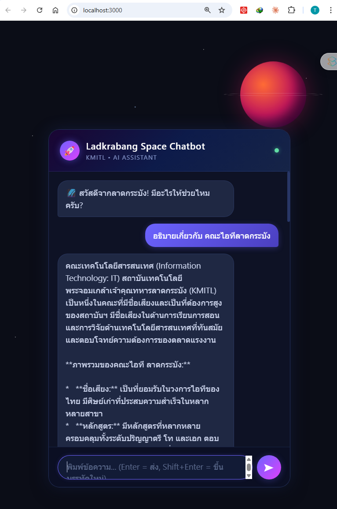

# Lab: Docker Compose — Chatbot Application

## สารบัญ

- [ภาพรวมของ Lab](#-ภาพรวมของ-lab)
- [สถาปัตยกรรมระบบ](#-สถาปัตยกรรมระบบ-architecture)
- [โครงสร้างไฟล์](#-โครงสร้างไฟล์)
- [ขั้นตอนการทำ Lab](#-ขั้นตอนการทำ-lab)
- [อธิบาย Code อย่างละเอียด](#-อธิบาย-code-อย่างละเอียด)
- [ตัวอย่างหน้าจอ](#-ตัวอย่างหน้าจอ)
- [คำสั่ง Docker Compose ที่ใช้บ่อย](#-คำสั่ง-docker-compose-ที่ใช้บ่อย)
- [การแก้ปัญหาที่พบบ่อย](#-การแก้ปัญหาที่พบบ่อย)

---

## ภาพรวมของ Lab

Lab นี้จะสอนการใช้ **Docker Compose** เพื่อรัน **multi-container application** โดยสร้าง **Chatbot** ที่ประกอบด้วย 2 services:

| Service | เทคโนโลยี | หน้าที่ |
|---------|-----------|---------|
| **Frontend** | Python HTTP Server + HTML/CSS/JS | หน้าเว็บ Chatbot สำหรับผู้ใช้ |
| **Backend** | Flask + Google Gemini API | รับข้อความจาก Frontend แล้วส่งไปถาม AI |

### สิ่งที่จะได้เรียนรู้

1. การเขียน `Dockerfile` สำหรับ Frontend และ Backend
2. การเขียน `docker-compose.yml` เพื่อรัน multi-container
3. การใช้ **Environment Variables** (`env_file`) ส่ง API Key เข้า container
4. การใช้ **Docker Network** ให้ containers สื่อสารกัน
5. การใช้ `depends_on` กำหนดลำดับการเริ่มต้น services

---

## สถาปัตยกรรมระบบ (Architecture)

```
                     Docker Compose
    ┌─────────────────────────────────────────────┐
    │                                             │
    │   ┌───────────────┐   ┌──────────────────┐  │
    │   │   Frontend     │   │     Backend      │  │
    │   │ (Python HTTP)  │   │  (Flask+Gemini)  │──── Google Gemini API
    │   │   Port: 80     │   │   Port: 8000     │  │   (ภายนอก)
    │   └───────────────┘   └──────────────────┘  │
    │         │                      │            │
    │         │    chatbot-network   │            │
    │         │    (Docker Bridge)   │            │
    └─────────│──────────────────────│────────────┘
              │                      │
              ▼                      ▼
     http://localhost:3000   http://localhost:5555
     (เปิดหน้าเว็บ)          (API โดยตรง)
```

### Flow การทำงาน

```
ผู้ใช้พิมพ์ข้อความ
       │
       ▼
┌─────────────┐  POST http://localhost:5555/chat  ┌──────────┐
│  Browser    │ ───────────────────────────────> │  Flask   │ ──> Google Gemini AI
│  (HTML/JS)  │ <─────────────────────────────── │  (API)   │ <── คำตอบ
└─────────────┘        JSON Response             └──────────┘
```

1. **ผู้ใช้** เปิดเว็บที่ `http://localhost:3000` (Frontend)
2. **ผู้ใช้** พิมพ์ข้อความในกล่องแชท
3. **JavaScript** ส่ง `POST http://localhost:5555/chat` ไปยัง Backend โดยตรง
4. **Flask** เรียก Google Gemini API แล้วส่งคำตอบกลับ
5. **หน้าเว็บ** แสดงคำตอบจาก AI ในกล่องแชท

---

## โครงสร้างไฟล์

```
01_chatbot/
├── docker-compose.yml          # ไฟล์หลัก — กำหนด services ทั้งหมด
├── .env.example                # ไฟล์ environment variables (ใส่ GEMINI_API_KEY)
│
├── backend/
│   ├── Dockerfile              # สร้าง image สำหรับ Backend
│   ├── app.py                  # Flask API — เชื่อมต่อ Gemini AI
│   └── requirements.txt        # Python dependencies
│
├── frontend/
│   ├── Dockerfile              # สร้าง image สำหรับ Frontend
│   └── index.html              # หน้าเว็บ Chatbot (HTML/CSS/JS)
│
└── readme.md                   # ไฟล์นี้
```

---

## ขั้นตอนการทำ Lab

### ขั้นตอนที่ 1: เตรียม API Key

ก่อนเริ่มต้น ต้องมี **Google Gemini API Key** สมัครได้ที่ https://aistudio.google.com/apikey

แก้ไขไฟล์ `.env.example` ใส่ API Key ของคุณ:

```bash
# เข้าไปยัง folder ของ lab
cd 01_chatbot
```

เปิดไฟล์ `.env.example` แล้วแก้ไข:

```env
GEMINI_API_KEY=AIzaSy.....your_real_key_here
```

> **คำเตือน:** ห้ามแชร์ API Key ของคุณกับผู้อื่น และห้าม commit ไฟล์ที่มี API Key จริงขึ้น Git

---

### ขั้นตอนที่ 2: ทำความเข้าใจ docker-compose.yml

เปิดไฟล์ `docker-compose.yml` และศึกษาโครงสร้าง:

```yaml
services:
  # ──────────────────────────────────────
  # Frontend Service — Static File Server
  # ──────────────────────────────────────
  frontend:
    build: ./frontend          # สร้าง image จาก frontend/Dockerfile
    ports:
      - "3000:80"              # map port 3000 (host) → 80 (container)
    depends_on:
      - backend                # รอให้ backend เริ่มก่อน
    networks:
      - chatbot-network        # เชื่อมต่อเข้า network

  # ──────────────────────────────────────
  # Backend Service — Flask + Gemini API
  # ──────────────────────────────────────
  backend:
    build: ./backend           # สร้าง image จาก backend/Dockerfile
    ports:
      - "5555:8000"            # map port 5555 (host) → 8000 (container)
    env_file:
      - .env.example           # โหลด environment variables จาก .env.example
    networks:
      - chatbot-network        # เชื่อมต่อเข้า network เดียวกัน

networks:
  chatbot-network:
    driver: bridge             # ใช้ bridge network
```

### อธิบายแต่ละส่วน

| Key | ความหมาย |
|-----|---------|
| `services` | กำหนดรายการ containers ที่จะรัน |
| `build: ./frontend` | สร้าง Docker image จาก `Dockerfile` ใน folder `frontend/` |
| `ports: "3000:80"` | เปิดให้เข้าถึง container port 80 ผ่าน host port 3000 |
| `ports: "5555:8000"` | เปิดให้เข้าถึง container port 8000 ผ่าน host port 5555 |
| `depends_on: backend` | Docker Compose จะเริ่ม `backend` ก่อน `frontend` |
| `env_file: .env.example` | โหลด environment variables จากไฟล์ `.env.example` เข้า container |
| `networks` | สร้าง virtual network ให้ containers คุยกันได้โดยใช้ชื่อ service เป็น hostname |

> **สำคัญ:** ใน Docker Compose network เราสามารถใช้ **ชื่อ service** (`backend`) เป็น hostname ได้เลย เช่น `http://backend:8000` โดยไม่ต้องรู้ IP address

---

### ขั้นตอนที่ 3: ทำความเข้าใจ Dockerfiles

#### Backend Dockerfile (`backend/Dockerfile`)

```dockerfile
# ใช้ Python 3.11 เวอร์ชัน slim (ขนาดเล็ก)
FROM python:3.11-slim

# ตั้ง working directory ภายใน container
WORKDIR /app

# คัดลอกไฟล์ requirements แล้วติดตั้ง dependencies
COPY requirements.txt .
RUN pip install --no-cache-dir -r requirements.txt

# คัดลอก source code ทั้งหมด
COPY . .

# เปิด port 8000
EXPOSE 8000

# รัน Flask application
CMD ["python", "app.py"]
```

| คำสั่ง | ความหมาย |
|--------|---------|
| `FROM python:3.11-slim` | ใช้ base image Python 3.11 ขนาดเล็ก |
| `WORKDIR /app` | สร้างและเข้าไปทำงานใน `/app` |
| `COPY requirements.txt .` | คัดลอก requirements เข้า container |
| `RUN pip install ...` | ติดตั้ง Python packages (flask, google-genai, flask-cors) |
| `COPY . .` | คัดลอก source code ทั้งหมดเข้า container |
| `EXPOSE 8000` | บอกว่า container ใช้ port 8000 |
| `CMD ["python", "app.py"]` | คำสั่งที่รันเมื่อ container เริ่มทำงาน |

#### Frontend Dockerfile (`frontend/Dockerfile`)

```dockerfile
# ใช้ Python Alpine (ขนาดเล็ก ~50MB)
FROM python:3.11-alpine

# ตั้ง working directory
WORKDIR /app

# คัดลอกไฟล์ HTML
COPY index.html .

# เปิด port 80
EXPOSE 80

# รัน Python built-in HTTP server
CMD ["python", "-m", "http.server", "80"]
```

| คำสั่ง | ความหมาย |
|--------|---------|
| `FROM python:3.11-alpine` | ใช้ Python Alpine base image (เล็ก เร็ว) |
| `WORKDIR /app` | ตั้ง working directory |
| `COPY index.html .` | คัดลอกหน้าเว็บ chatbot เข้า container |
| `EXPOSE 80` | เปิด port 80 |
| `CMD ["python", "-m", "http.server", "80"]` | ใช้ Python built-in HTTP server ให้บริการไฟล์ static |

> **หมายเหตุ:** `python -m http.server` เป็น HTTP server อย่างง่ายที่มาพร้อม Python เหมาะสำหรับการเรียนรู้ (ไม่แนะนำใช้ใน production)

---

### ขั้นตอนที่ 4: Build และ Run

```bash
# เข้าไปยัง folder ของ lab
cd 01_chatbot

# สร้าง images และรันทุก services (foreground mode - เห็น logs)
docker-compose up --build
```

**ผลลัพธ์ที่คาดหวัง:**

```
[+] Building 15.2s (12/12) FINISHED
 => [backend] ...
 => [frontend] ...
[+] Running 3/3
 ✔ Network 01_chatbot_chatbot-network  Created
 ✔ Container 01_chatbot-backend-1      Created
 ✔ Container 01_chatbot-frontend-1     Created
Attaching to backend-1, frontend-1
backend-1   |  * Running on all addresses (0.0.0.0)
backend-1   |  * Running on http://127.0.0.1:8000
frontend-1  | Serving HTTP on 0.0.0.0 port 80 ...
```

> สังเกต: Docker Compose สร้าง **network** `chatbot-network` และ **2 containers** ให้อัตโนมัติ

---

### ขั้นตอนที่ 5: ทดสอบ

#### 5.1 เปิดหน้าเว็บ Chatbot

เปิด Browser แล้วไปที่:

```
http://localhost:3000
```

จะเห็นหน้า Chatbot ธีมอวกาศพร้อมใช้งาน (ดูตัวอย่างหน้าจอได้ที่ [ส่วนตัวอย่างหน้าจอ](#ตัวอย่างหน้าจอ))

#### 5.2 ทดสอบ Backend API โดยตรง

ทดสอบ health check:

```bash
curl http://localhost:5555/health
```

ผลลัพธ์:

```json
{"model": "gemini-2.0-flash", "status": "ok"}
```

ทดสอบ chat API:

```bash
curl -X POST http://localhost:5555/chat \
  -H "Content-Type: application/json" \
  -d '{"message": "สวัสดี", "history": []}'
```

ผลลัพธ์:

```json
{"reply": "สวัสดีครับ! มีอะไรให้ช่วยไหมครับ?"}
```

#### 5.3 ทดสอบแชทผ่านหน้าเว็บ

1. เปิด `http://localhost:3000`
2. พิมพ์ข้อความ เช่น "Docker คืออะไร?"
3. กด Enter หรือกดปุ่มส่ง
4. รอสักครู่ จะเห็นคำตอบจาก AI

---

### ขั้นตอนที่ 6: หยุด Services

```bash
# กด Ctrl+C ถ้ารันใน foreground mode

# หรือใช้คำสั่ง (ถ้ารันใน detached mode)
docker-compose down
```

---

## อธิบาย Code อย่างละเอียด

### Backend — `app.py`

#### 1. Import และ Configuration

```python
import os
from flask import Flask, request, jsonify
from flask_cors import CORS
from google import genai
from google.genai import types

API_KEY    = os.environ.get("GEMINI_API_KEY", "Your GEMINI_API_KEY")
MODEL_NAME = "gemini-2.0-flash"

client = genai.Client(api_key=API_KEY)
app    = Flask(__name__)
CORS(app)
```

| บรรทัด | ความหมาย |
|--------|---------|
| `os.environ.get("GEMINI_API_KEY")` | อ่าน API Key จาก environment variable (มาจาก `.env.example` ผ่าน docker-compose) |
| `genai.Client(api_key=API_KEY)` | สร้าง client สำหรับเรียก Google Gemini API |
| `Flask(__name__)` | สร้าง Flask web application |
| `CORS(app)` | อนุญาตให้ Frontend เรียก API ข้าม domain ได้ (Cross-Origin Resource Sharing) |

> **CORS คืออะไร?** เนื่องจาก Frontend (port 3000) และ Backend (port 5555) อยู่คนละ port ถือเป็นคนละ origin Browser จะบล็อก request ข้าม origin โดย default `CORS(app)` ช่วยอนุญาตให้ทำได้

#### 2. ฟังก์ชัน `call_gemini()` — เรียก AI

```python
def call_gemini(prompt, history=None, temperature=0.7, max_tokens=2048):
    contents = []
    if history:
        for turn in history:
            contents.append(
                types.Content(role=turn["role"], parts=[types.Part(text=turn["parts"])])
            )
    contents.append(
        types.Content(role="user", parts=[types.Part(text=prompt)])
    )

    response = client.models.generate_content(
        model=MODEL_NAME,
        contents=contents,
        config=types.GenerateContentConfig(
            temperature=temperature,
            max_output_tokens=max_tokens,
        ),
    )
    return response.text
```

| พารามิเตอร์ | ความหมาย |
|-------------|---------|
| `prompt` | ข้อความจากผู้ใช้ (ล่าสุด) |
| `history` | ประวัติการสนทนาก่อนหน้า เช่น `[{"role": "user", "parts": "สวัสดี"}, {"role": "model", "parts": "สวัสดีครับ!"}]` |
| `temperature` | **0.0** = ตอบแม่นยำ, **1.0** = ตอบสร้างสรรค์ (default: 0.7) |
| `max_tokens` | จำนวน token สูงสุดที่ AI จะสร้าง |

**Flow:**
1. สร้าง `contents` list จาก history (ถ้ามี) — ทำให้ AI จำบทสนทนาก่อนหน้าได้
2. เพิ่มข้อความปัจจุบันของผู้ใช้
3. เรียก Gemini API ด้วย `client.models.generate_content()`
4. คืนค่าข้อความตอบกลับ

#### 3. API Endpoints

```python
@app.route("/chat", methods=["POST"])
def chat():
    data    = request.get_json()
    message = data.get("message", "").strip()
    history = data.get("history", [])

    if not message:
        return jsonify({"error": "message ว่างเปล่า"}), 400

    try:
        reply = call_gemini(prompt=message, history=history)
        return jsonify({"reply": reply})
    except Exception as e:
        return jsonify({"error": str(e)}), 500


@app.route("/health", methods=["GET"])
def health():
    return jsonify({"status": "ok", "model": MODEL_NAME})
```

| Endpoint | Method | รับ (Request) | คืน (Response) |
|----------|--------|---------------|----------------|
| `/chat` | POST | `{"message": "...", "history": [...]}` | `{"reply": "..."}` |
| `/health` | GET | ไม่มี | `{"status": "ok", "model": "gemini-2.0-flash"}` |

#### 4. รัน Server

```python
if __name__ == "__main__":
    app.run(host="0.0.0.0", port=8000, debug=True)
```

- `host="0.0.0.0"` — รับ request จากทุก IP (จำเป็นสำหรับ Docker เพราะ request มาจากภายนอก container)
- `port=8000` — รันที่ port 8000 ภายใน container
- `debug=True` — แสดง error details (สำหรับการพัฒนา)

---

### Frontend — `index.html` (JavaScript)

#### ส่งข้อความไปยัง Backend

```javascript
const API_URL = "http://localhost:5555/chat";   // เรียก Backend โดยตรง

let history = [];   // เก็บประวัติการสนทนา

async function sendMessage() {
    const text = inputEl.value.trim();
    if (!text) return;

    addMessage(text, "user");                          // แสดงข้อความผู้ใช้
    const loadingDiv = addMessage("กำลังคิด...", "bot loading");  // แสดง loading

    try {
        const res = await fetch(API_URL, {
            method: "POST",
            headers: { "Content-Type": "application/json" },
            body: JSON.stringify({ message: text, history }),  // ส่ง message + history
        });

        const data = await res.json();
        if (data.error) throw new Error(data.error);

        // เก็บ history เพื่อให้ AI จำบริบทได้
        history.push({ role: "user",  parts: text });
        history.push({ role: "model", parts: data.reply });

        loadingDiv.textContent = data.reply;           // แสดงคำตอบ AI
    } catch (err) {
        loadingDiv.textContent = `เกิดข้อผิดพลาด: ${err.message}`;
    }
}
```

**Flow:**
1. รับข้อความจาก input field
2. แสดงข้อความผู้ใช้ในกล่องแชท (ฝั่งขวา)
3. แสดง "กำลังคิด..." ขณะรอ Backend ตอบ
4. ส่ง `POST` request ไปยัง `http://localhost:5555/chat` พร้อม message และ history
5. รับคำตอบแล้วแสดงในกล่องแชท (ฝั่งซ้าย)
6. เก็บ history ไว้สำหรับส่งในรอบถัดไป — **ทำให้ AI จำบริบทการสนทนาได้**

#### Event Listeners

```javascript
// กดปุ่มส่ง
sendBtn.addEventListener("click", sendMessage);

// กด Enter = ส่ง, Shift+Enter = ขึ้นบรรทัดใหม่
inputEl.addEventListener("keydown", (e) => {
    if (e.key === "Enter" && !e.shiftKey) {
        e.preventDefault();
        sendMessage();
    }
});
```

---

## ตัวอย่างหน้าจอ

### หน้าเว็บ Chatbot

เมื่อเปิด `http://localhost:3000` จะเห็นหน้า Chatbot ธีมอวกาศ สามารถพิมพ์ข้อความแล้วรอคำตอบจาก AI ได้เลย:



### Terminal — docker-compose up --build

```
$ docker-compose up --build

[+] Building 18.3s (14/14) FINISHED
 => [backend] FROM python:3.11-slim
 => [backend] COPY requirements.txt .
 => [backend] RUN pip install --no-cache-dir -r requirements.txt
 => [backend] COPY . .
 => [frontend] FROM python:3.11-alpine
 => [frontend] COPY index.html .

[+] Running 3/3
 ✔ Network 01_chatbot_chatbot-network  Created     0.1s
 ✔ Container 01_chatbot-backend-1      Started     0.5s
 ✔ Container 01_chatbot-frontend-1     Started     0.8s

backend-1   |  * Serving Flask app 'app'
backend-1   |  * Debug mode: on
backend-1   |  * Running on all addresses (0.0.0.0)
backend-1   |  * Running on http://127.0.0.1:8000
frontend-1  | Serving HTTP on 0.0.0.0 port 80 ...
```

### Terminal — docker-compose ps

```
$ docker-compose ps

NAME                       IMAGE                    STATUS    PORTS
01_chatbot-backend-1       01_chatbot-backend       Up        0.0.0.0:5555->8000/tcp
01_chatbot-frontend-1      01_chatbot-frontend      Up        0.0.0.0:3000->80/tcp
```

### Terminal — ทดสอบ API ด้วย curl

```
$ curl http://localhost:5555/health
{"model":"gemini-2.0-flash","status":"ok"}

$ curl -X POST http://localhost:5555/chat \
  -H "Content-Type: application/json" \
  -d '{"message": "สวัสดี", "history": []}'
{"reply":"สวัสดีครับ! ยินดีต้อนรับ มีอะไรให้ช่วยไหมครับ?"}
```

---

## คำสั่ง Docker Compose ที่ใช้บ่อย

| คำสั่ง | ความหมาย |
|--------|---------|
| `docker-compose up --build` | Build images ใหม่และรันทุก services |
| `docker-compose up -d` | รันใน background (detached mode) |
| `docker-compose down` | หยุดและลบทุก containers + network |
| `docker-compose ps` | ดูสถานะของทุก services |
| `docker-compose logs` | ดู logs ของทุก services |
| `docker-compose logs backend` | ดู logs เฉพาะ backend |
| `docker-compose build` | Build images ใหม่ (ไม่รัน) |
| `docker-compose restart` | Restart ทุก services |
| `docker-compose exec backend bash` | เข้าไปใน container ของ backend |

---

## การแก้ปัญหาที่พบบ่อย

### 1. Error: "GEMINI_API_KEY" ไม่ถูกต้อง

```
backend-1  | google.api_core.exceptions.InvalidArgument: API key not valid
```

**วิธีแก้:** ตรวจสอบว่าไฟล์ `.env.example` มี API Key ที่ถูกต้อง

```bash
cat .env.example
```

### 2. Error: Port 3000 หรือ 5555 ถูกใช้งานอยู่

```
Error: bind: address already in use
```

**วิธีแก้:** หยุด process ที่ใช้ port นั้นอยู่ หรือเปลี่ยน port ใน `docker-compose.yml`

```yaml
# ตัวอย่าง: เปลี่ยน frontend จาก 3000 เป็น 3001
ports:
  - "3001:80"
```

### 3. Frontend ไม่สามารถเชื่อมต่อ Backend ได้

```
❌ เกิดข้อผิดพลาด: Failed to fetch
```

**วิธีแก้:**
- ตรวจสอบว่า backend รันอยู่: `docker-compose ps`
- ดู logs ของ backend: `docker-compose logs backend`
- ทดสอบ backend โดยตรง: `curl http://localhost:5555/health`

### 4. ต้องการ Build ใหม่หลังแก้ Code

```bash
# Build ใหม่ทุก services
docker-compose up --build

# Build ใหม่เฉพาะ backend
docker-compose build backend
docker-compose up
```

---

## สรุป Concepts ที่ได้เรียนรู้

```
┌───────────────────────────────────────────────────────────┐
│                      Docker Compose                       │
│                                                           │
│  ┌──────────────┐  docker-compose.yml  ┌───────────────┐  │
│  │  Dockerfile   │ ◄──── กำหนด ────►  │  Dockerfile    │  │
│  │  (backend)    │     services        │  (frontend)    │  │
│  └──────────────┘                     └───────────────┘  │
│        │                                     │           │
│        ▼                                     ▼           │
│  ┌──────────────┐                     ┌───────────────┐  │
│  │  Container    │ ◄── network ──►   │  Container     │  │
│  │  Flask:8000   │  chatbot-network  │  Python HTTP   │  │
│  └──────────────┘                     │  Server:80     │  │
│        │                              └───────────────┘  │
│   env_file: .env.example                    │            │
│   (GEMINI_API_KEY)                   ports: 3000:80     │
│   ports: 5555:8000                   (เข้าถึงจากภายนอก)  │
└───────────────────────────────────────────────────────────┘
```

| Concept | สิ่งที่ได้เรียนรู้ |
|---------|-------------------|
| **docker-compose.yml** | กำหนดหลาย services ในไฟล์เดียว |
| **build** | สร้าง image จาก Dockerfile ในแต่ละ folder |
| **ports** | Map port ระหว่าง host กับ container |
| **depends_on** | กำหนดลำดับการเริ่มต้น services |
| **env_file** | ส่ง environment variables เข้า container |
| **networks** | สร้าง virtual network ให้ containers คุยกัน |
| **CORS** | อนุญาตให้ Frontend เรียก Backend ข้าม port ได้ |
