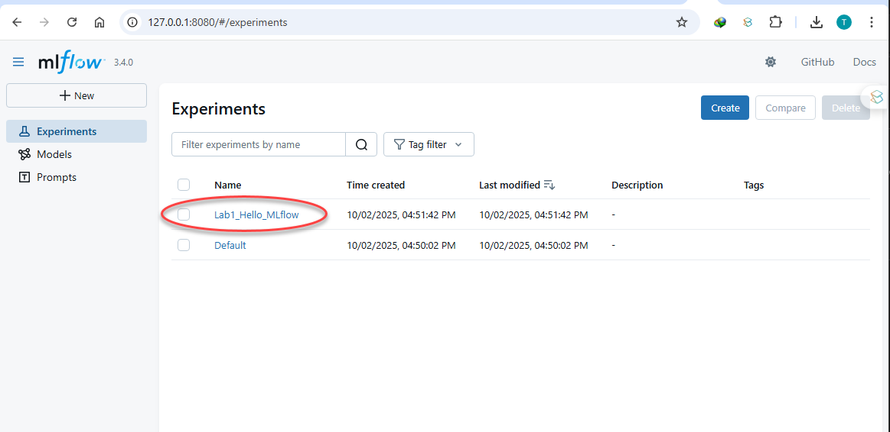
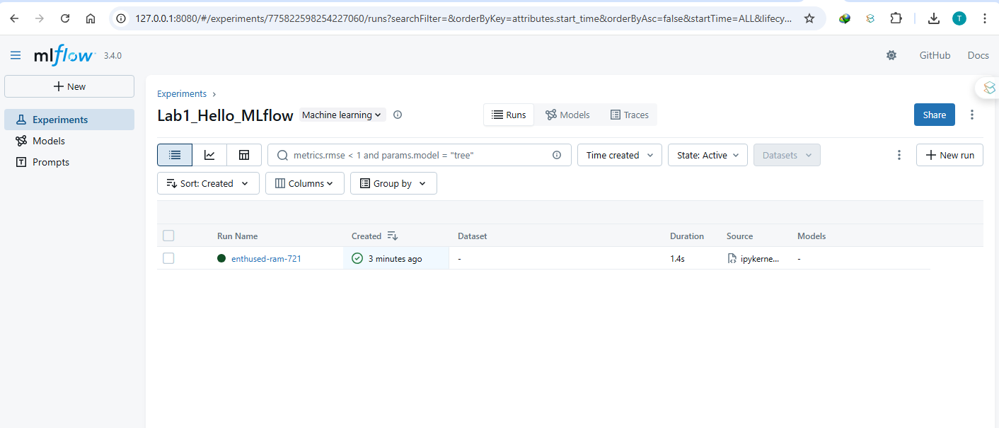
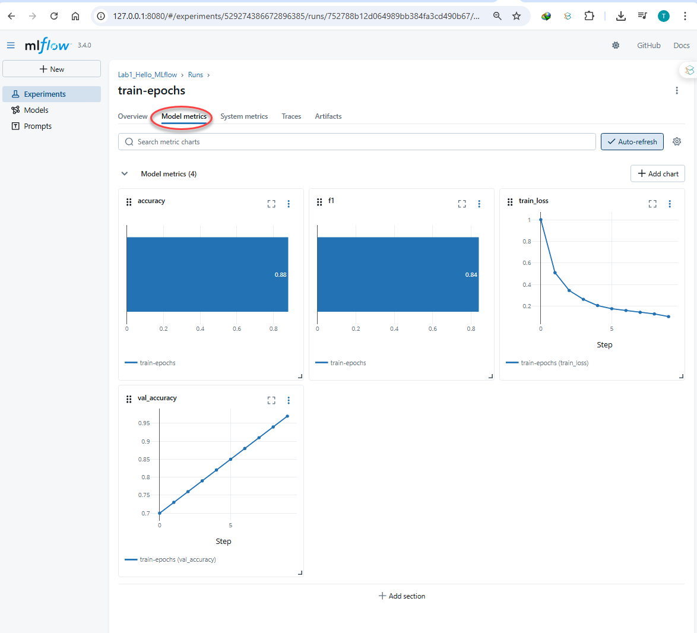

# 🚀 Introduction to MLflow Tracking – Hello World

## 🎯 Objective

In this lab, you will learn the fundamentals of **MLflow Tracking** and explore the **MLflow UI**.
You will practice how to:

* Launch and connect to the MLflow Tracking Server
* Create and manage experiments
* Log parameters, metrics, and artifacts
* Visualize results in the MLflow UI

This lab serves as your **first step** toward experiment management and reproducible ML workflows.

---

## 📦 Step 0: Setup Environment

Before starting, install the required Python packages:

```bash
pip install mlflow scikit-learn pandas numpy
```

✅ After installation, verify MLflow is available:

```bash
mlflow --version
```

---

## ⚙️ Step 1: Launch MLflow Tracking Server

You have two options to start the tracking server:

### 🔹 Method 1: Quick Start (In-Memory Backend)

```bash
mlflow server --host 127.0.0.1 --port 8080
```

* Uses in-memory storage (data lost when process ends).
* Best for **quick demos**.

---

### 🔹 Method 2: Persistent Tracking with SQLite + Local Artifacts

Instead of just `mlflow ui`, run MLflow with a **persistent backend** and **artifact store**:

```bash
mkdir -p mlruns_db mlartifacts
mlflow server \
  --host 127.0.0.1 --port 8080 \
  --backend-store-uri sqlite:///mlruns_db/mlflow.db \
  --artifacts-destination ./mlartifacts \
  --serve-artifacts
```

💡 Explanation of flags:

* **Backend Store URI** → Saves experiments, runs, params, metrics in SQLite.
* **Artifacts Destination** → Stores logged files (plots, models, text files).
* **Serve Artifacts** → Makes artifacts browsable via MLflow UI.

---

## 🌐 Step 2: Connect to MLflow UI

Once the server is running, open your browser at:

👉 [http://127.0.0.1:8080](http://127.0.0.1:8080)

Here you can view **experiments**, explore **runs**, and inspect **artifacts**.

---

## 📝 Step 3: Create Your First Experiment (Jupyter Notebook)

Follow these steps in a Jupyter Notebook:

### 🔹 Cell 1: Import Dependencies

```python
import mlflow
import mlflow.sklearn
from datetime import datetime
```

---

### 🔹 Cell 2: Set Experiment Name

```python
mlflow.set_experiment("Lab1_Hello_MLflow")
```

---

### 🔹 Cell 3: Run Experiment – Log Parameters, Metrics, and Artifacts

```python
with mlflow.start_run():
    # Log parameters
    mlflow.log_param("learning_rate", 0.01)
    mlflow.log_param("batch_size", 32)
    
    # Log metrics
    mlflow.log_metric("accuracy", 0.85)
    mlflow.log_metric("loss", 0.15)
    
    # Log an artifact (text file)
    with open("hello.txt", "w") as f:
        f.write(f"Hello MLflow! Time: {datetime.now()}")
    mlflow.log_artifact("hello.txt")
    
    print("✅ Run completed! Check MLflow UI")
```

📊 Example UI view:




---

### 🔹 Cell 4: Simulating Metrics Over Time

```python

import time
import random
import mlflow
import matplotlib.pyplot as plt

mlflow.set_experiment("Lab1_Hello_MLflow")

with mlflow.start_run(run_name="train-epochs"):
    # -------------------
    # Log parameters
    # -------------------
    mlflow.log_param("model", "logreg")
    mlflow.log_params({"lr": 1e-3, "optimizer": "adam", "epochs": 20})

    # Add tags (useful for filters in MLflow UI)
    mlflow.set_tag("dataset", "cifar10")
    mlflow.set_tags({"stage": "dev", "owner": "studentA"})

    # -------------------
    # Training loop
    # -------------------
    losses, accuracies = [], []

    for epoch in range(10):
        train_loss = 1.0 / (epoch + 1) + random.random() * 0.02
        val_accuracy = 0.7 + 0.03 * epoch

        losses.append(train_loss)
        accuracies.append(val_accuracy)

        mlflow.log_metric("train_loss", train_loss, step=epoch)
        mlflow.log_metric("val_accuracy", val_accuracy, step=epoch)

        time.sleep(0.05)  # so UI shows evolving timestamps (optional)

    # Final metrics
    mlflow.log_metrics({"accuracy": 0.88, "f1": 0.84})

    # -------------------
    # Log artifacts
    # -------------------

    # (1) Save a plot as artifact
    plt.figure()
    plt.plot(range(10), losses, label="train_loss")
    plt.plot(range(10), accuracies, label="val_accuracy")
    plt.xlabel("Epoch")
    plt.ylabel("Value")
    plt.title("Training Curve")
    plt.legend()
    plt.savefig("training_curve.png")
    plt.close()
    mlflow.log_artifact("training_curve.png")

    # (2) Save a text file as artifact
    with open("summary.txt", "w") as f:
        f.write("Experiment Summary\n")
        f.write("=================\n")
        f.write(f"Final Accuracy: {0.88}\n")
        f.write(f"Final F1 Score: {0.84}\n")
        f.write("Notes: Model = logreg, Optimizer = adam, Dataset = cifar10\n")

    mlflow.log_artifact("summary.txt")

print("Run completed! Check MLflow UI for parameters, metrics, and artifacts.")

```

📊 Example UI view:




---

## 🖥️ MLflow UI Walkthrough

When you open the MLflow UI, you’ll see:

* **Experiment List** → Displays all available experiments (e.g., `Lab1_Hello_MLflow`).
* **Runs Table** → Each run shows parameters, metrics, and status.
* **Run Detail Page** → Drill down into metrics charts, logged artifacts, and tags.
* **Artifact Browser** → Access files and outputs logged during runs.

---

✨ **Congratulations!**
You have successfully launched MLflow, created experiments, logged runs, and explored results in the MLflow UI. This is the foundation for **tracking, comparing, and reproducing ML experiments** in future labs.

---

Do you want me to also **add a "Next Steps" section** at the end (like Lab 2 preview → Model Training & Signature Inference), so it smoothly connects to your step-by-step lab series?
