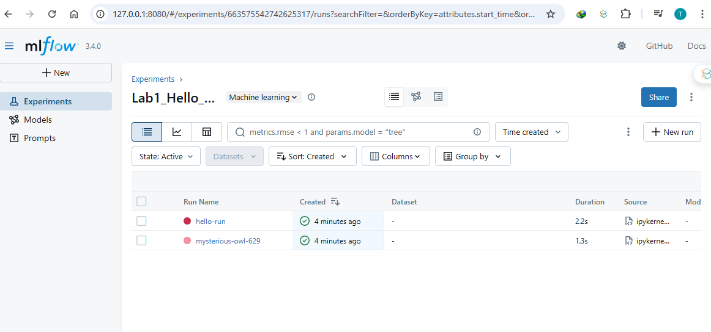
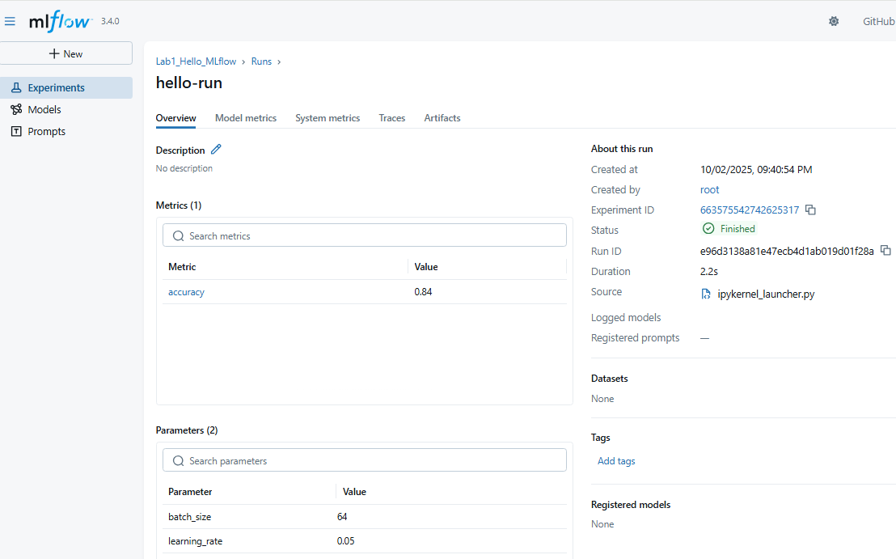
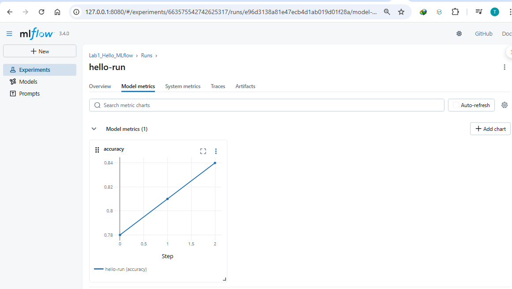

# 🚀 Lab 1: Introduction to MLflow Tracking - Hello World

## 🎯 Objective
Learn the basics of **MLflow Tracking** and connect to the **MLflow UI** to explore experiments, runs, parameters, metrics, and artifacts.

---

## 📦 Step 0: Setup Environment

Make sure MLflow is installed:

```bash
pip install mlflow scikit-learn pandas numpy
````

---

## ⚙️ Step 1: Launch MLflow Tracking Server

Run method 1 :

```bash
mlflow server --host 127.0.0.1 --port 8080
```

Run method 2 :


Instead of using the simple `mlflow ui`, run the **MLflow Tracking Server** with SQLite backend and local artifact storage:

```bash
mkdir -p mlruns_db mlartifacts
mlflow server \
  --host 127.0.0.1 --port 8080 \
  --backend-store-uri sqlite:///mlruns_db/mlflow.db \
  --artifacts-destination ./mlartifacts \
  --serve-artifacts
```

* **Backend Store URI** → Saves experiment metadata (experiments, runs, params, metrics).
* **Artifacts Destination** → Stores logged files (artifacts).
* **Serve Artifacts** → Makes artifacts browsable from MLflow UI.

---

## 🌐 Connect to MLflow UI

Open your browser and go to:

👉 [http://127.0.0.1:8080](http://127.0.0.1:8080)

---


## 📝 Step 2: Create Your First MLflow Experiment (Jupyter Notebook Version)

Open a **Jupyter Notebook** and add the following cells step by step:

### 🔹 Cell 1: Import Dependencies

```python
import mlflow
import mlflow.sklearn
from datetime import datetime
```

---

### 🔹 Cell 2: Set Experiment Name

```python
mlflow.set_experiment("Lab1_Hello_MLflow")
```

---

### 🔹 Cell 3: Start MLflow Run and Log Parameters/Metrics

```python
with mlflow.start_run():
    # Log parameters
    mlflow.log_param("learning_rate", 0.01)
    mlflow.log_param("batch_size", 32)
    
    # Log metrics
    mlflow.log_metric("accuracy", 0.85)
    mlflow.log_metric("loss", 0.15)
    
    # Log an artifact (text file)
    with open("hello.txt", "w") as f:
        f.write(f"Hello MLflow! Time: {datetime.now()}")
    mlflow.log_artifact("hello.txt")
    
    print("✅ Run completed! Check MLflow UI")
```


---


---

### 🔹 Cell 4: Start MLflow Run and Log Parameters/Metrics

```python

import mlflow, os, time
mlflow.set_experiment("Lab1_Hello_MLflow")

with mlflow.start_run(run_name="hello-run"):
    # Params
    mlflow.log_param("learning_rate", 0.05)
    mlflow.log_param("batch_size", 64)

    # Metrics (simulate improvement over time)
    for step, acc in enumerate([0.78, 0.81, 0.84]):
        mlflow.log_metric("accuracy", acc, step=step)
        time.sleep(0.2)

    # Artifact (a small text file)
    os.makedirs("artifacts", exist_ok=True)
    with open("artifacts/readme.txt", "w") as f:
        f.write("Hello MLflow! This file is tracked as an artifact.")
    mlflow.log_artifact("artifacts/readme.txt")

print("✅ Lab 1 complete. Check the MLflow UI → Experiments → Lab1_Hello_MLflow.")

```






---


## 🖥️ MLflow UI Walkthrough

When you open the MLflow UI, you’ll see:

**Experiment List**

   * Shows available experiments, e.g., `Lab1_Hello_MLflow`.


