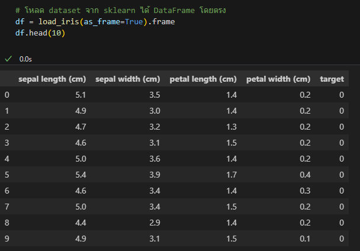
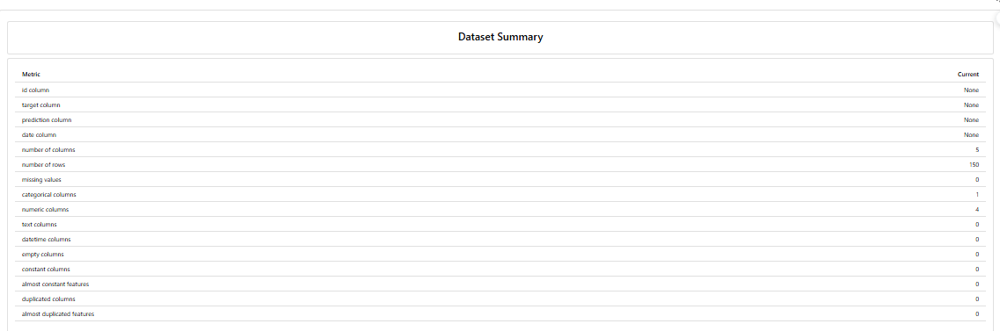
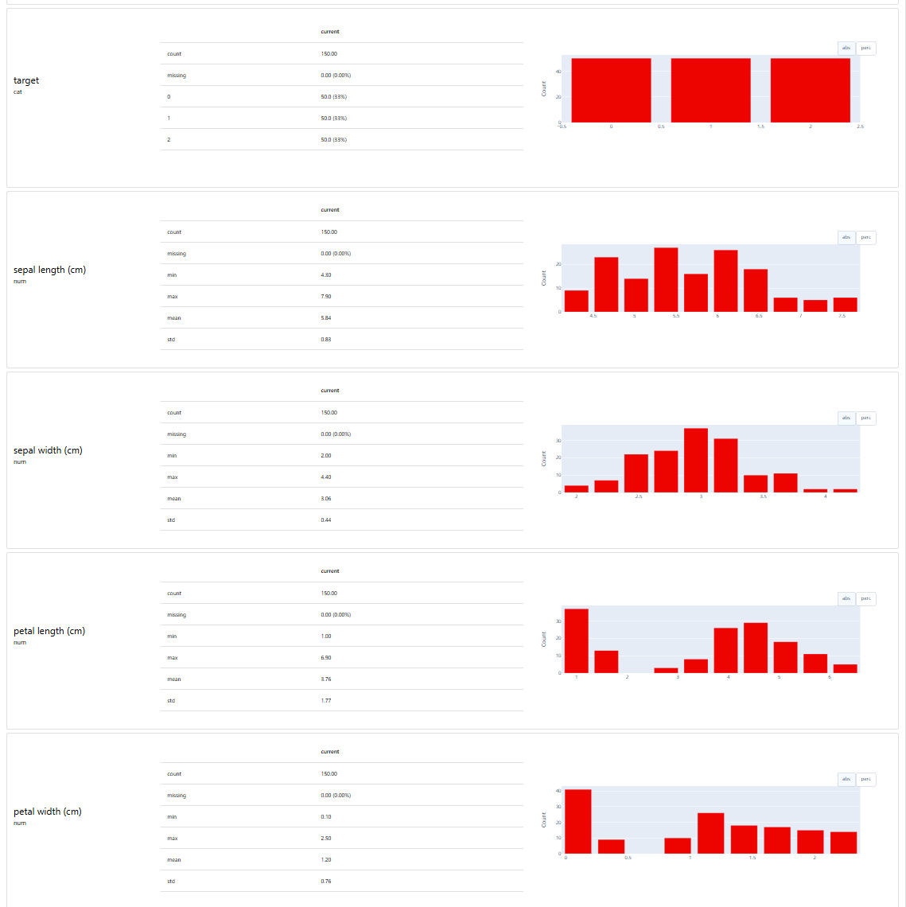
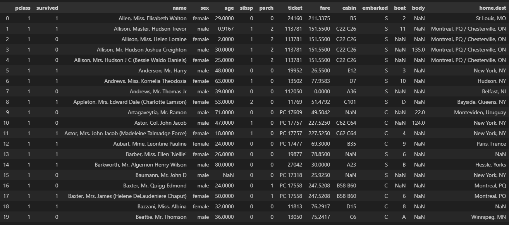
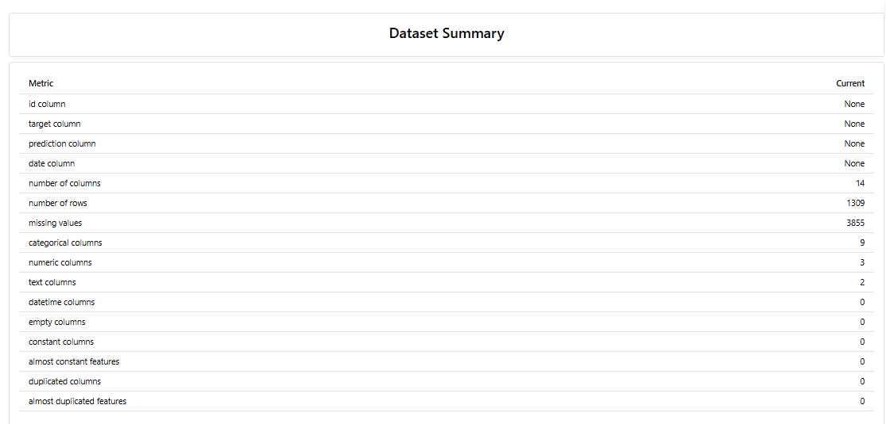
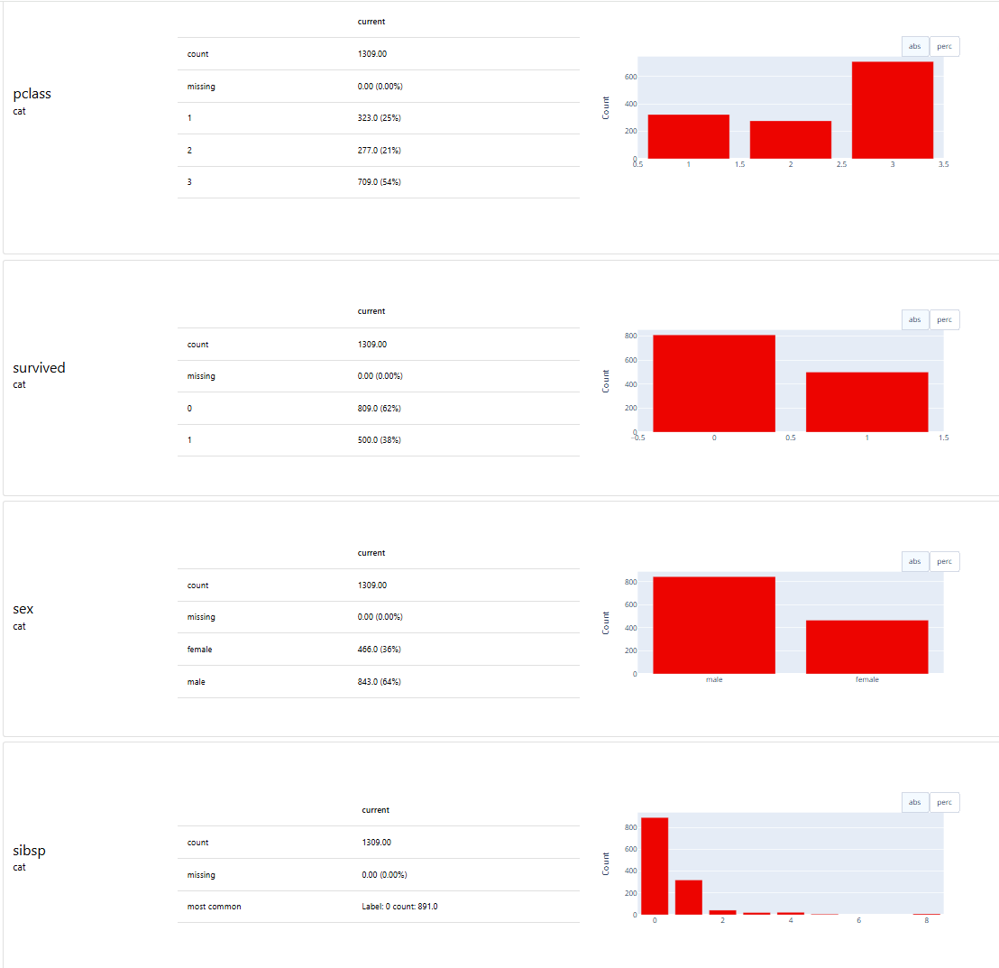
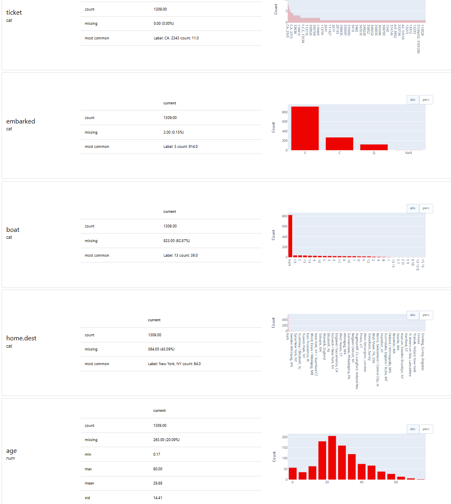

# 📊 Introduction to Evidently AI

## 🎯 Objective

เรียนรู้การใช้ **Evidently AI** เพื่อ

* ตรวจสอบคุณภาพของข้อมูล (Data Quality)
* ตรวจจับการเปลี่ยนแปลงของข้อมูล (Data Drift / Concept Drift)
* สร้างรายงานวิเคราะห์ข้อมูล (Monitoring Reports)
* เชื่อมต่อกับ MLOps Workflow (เช่น MLflow, CI/CD, Airflow ฯลฯ)

---

## 📦 Step 0: Installation

ติดตั้ง Evidently AI ด้วยคำสั่ง:

```bash
pip install evidently
```

---

## 🔍 Step 1: ตรวจสอบคุณภาพข้อมูล (Data Quality Report)

Evidently สามารถสร้างรายงานคุณภาพข้อมูล เช่น missing values, outliers, distribution ฯลฯ

1. Iris Dataset

```python

import pandas as pd
from sklearn.datasets import load_iris

from evidently import Report
from evidently.metrics import *
from evidently.presets import *


# โหลด dataset จาก sklearn ได้ DataFrame โดยตรง
df = load_iris(as_frame=True).frame


# สร้างรายงาน Data Quality
report = Report([ DataSummaryPreset()])
eval = report.run(df_iris,None)

eval.save_html("iris_data_quality_report.html")


```






1. Titanic Dataset

```python

import pandas as pd
from sklearn.datasets import fetch_openml

from evidently import Report
from evidently.metrics import *
from evidently.presets import *

# Download Titanic dataset from OpenML
df_titanic = fetch_openml("titanic", version=1, as_frame=True).frame

# สร้างรายงาน Data Quality
report = Report([ DataSummaryPreset()])
eval = report.run(df_titanic,None)

eval.save_html("titanic_data_quality_report.html")

```






